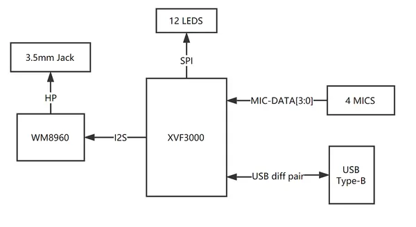
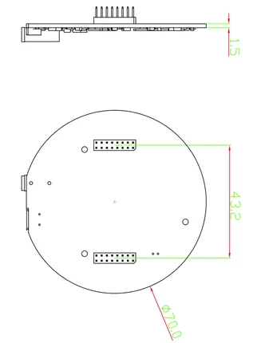
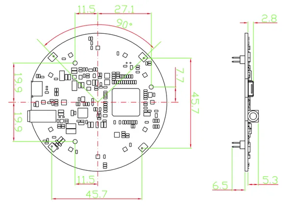
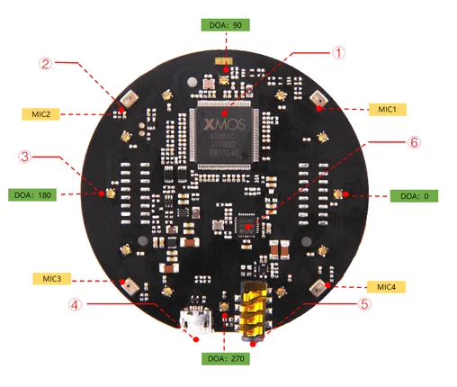
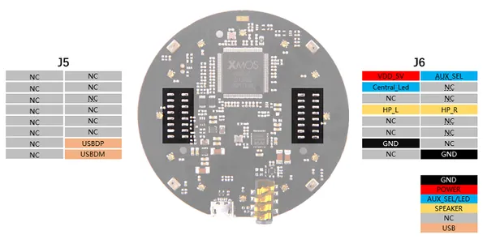

# reSpeaker USB 4-Mic Array XVF3000 V2.0

**Seeed Studio** · Source collection

Revision: Unverified source identity  
Coverage: Source collection; review pending

[Browse all manufacturers](../../../../BROWSE.md) · [Desktop app](https://github.com/valleytechsolutions/black-wire-desktop)

## Block Diagram

**source reference** · Unreviewed source · PNG

[Open original reference](../../../../library/media/56c002d25096170a46ecb3039adba86c251f74fe3df5d9f96e002f62f51fdf02.png)

**Credit and rights:** Source rights not yet established. Source/manufacturer: Seeed Studio.

[Source 1](https://files.seeedstudio.com/wiki/ReSpeaker_Mic_Array_V2/img/system_diag.png) · [Source 2](https://wiki.seeedstudio.com/ReSpeaker-USB-Mic-Array/)

Original source index: Block Diagram. This file is searchable but has not been promoted to a reviewed physical board pinout.

SHA-256: `56c002d25096170a46ecb3039adba86c251f74fe3df5d9f96e002f62f51fdf02`

## Dimensions (Bottom)

**source reference** · Unreviewed source · PNG

[Open original reference](../../../../library/media/74211e2be8448f5f3f9f02631f076cdf892c505444ea4a17afc5236cd2936b27.png)

**Credit and rights:** Source rights not yet established. Source/manufacturer: Seeed Studio.

[Source 1](https://files.seeedstudio.com/wiki/ReSpeaker_Mic_Array_V2/img/Dimension1.png) · [Source 2](https://wiki.seeedstudio.com/ReSpeaker_Mic_Array_v2.0/)

Original source index: Dimensions (Bottom). This file is searchable but has not been promoted to a reviewed physical board pinout.

SHA-256: `74211e2be8448f5f3f9f02631f076cdf892c505444ea4a17afc5236cd2936b27`

## Dimensions

**source reference** · Unreviewed source · PNG

[Open original reference](../../../../library/media/628a9acffd3800864b582a7c3e86b1bc85aa1f07bf9dc5d098775930d6c9e983.png)

**Credit and rights:** Source rights not yet established. Source/manufacturer: Seeed Studio.

[Source 1](https://files.seeedstudio.com/wiki/ReSpeaker_Mic_Array_V2/img/Dimension.png) · [Source 2](https://wiki.seeedstudio.com/ReSpeaker_Mic_Array_v2.0/)

Original source index: Dimensions. This file is searchable but has not been promoted to a reviewed physical board pinout.

SHA-256: `628a9acffd3800864b582a7c3e86b1bc85aa1f07bf9dc5d098775930d6c9e983`

## Hardware Overview

**source reference** · Unreviewed source · PNG

[Open original reference](../../../../library/media/842c4199539c5dc4e89020533a786177bcc498c7536e44bd61b436ca0dafbdbd.png)

**Credit and rights:** Source rights not yet established. Source/manufacturer: Seeed Studio.

[Source 1](https://files.seeedstudio.com/wiki/ReSpeaker_Mic_Array_V2/img/Hardware%20Overview.png) · [Source 2](https://wiki.seeedstudio.com/ReSpeaker_Mic_Array_v2.0/)

Original source index: Hardware Overview. This file is searchable but has not been promoted to a reviewed physical board pinout.

SHA-256: `842c4199539c5dc4e89020533a786177bcc498c7536e44bd61b436ca0dafbdbd`

## Pin Definition Table

**source reference** · Unreviewed source · PNG

[Open original reference](../../../../library/media/1fdf127168dc4104708a2fcfee8ecb772a1039a4414914fb4942775c2ef8279a.png)

**Credit and rights:** Source rights not yet established. Source/manufacturer: Seeed Studio.

[Source 1](https://files.seeedstudio.com/wiki/ReSpeaker_Mic_Array_V2/img/Pin_Map.png) · [Source 2](https://wiki.seeedstudio.com/ReSpeaker_Mic_Array_v2.0/)

Original source index: Pin Definition Table. This file is searchable but has not been promoted to a reviewed physical board pinout.

SHA-256: `1fdf127168dc4104708a2fcfee8ecb772a1039a4414914fb4942775c2ef8279a`

Pin assignments have not been independently electrically verified. Check board revision before wiring.
