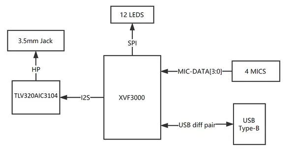
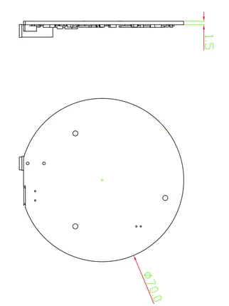
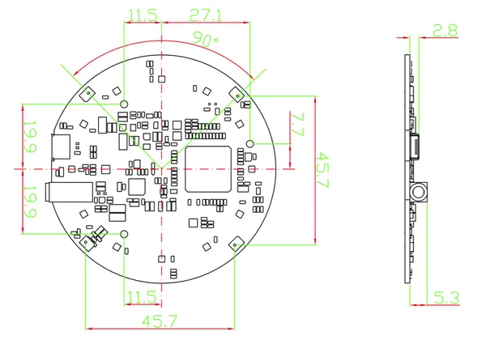

# reSpeaker USB 4-Mic Array XVF3000 V3.0

**Seeed Studio** · Source collection

Revision: Unverified source identity  
Coverage: Source collection; review pending

[Browse all manufacturers](../../../../BROWSE.md) · [Devices & IoT](../../../../DEVICES.md) · [Open in the browser guide](https://valleytech-black-wire-guide.pages.dev/?board=source-board-d621c05b7c575ff0d3)

Device category: **Cameras & audio**

## Block Diagram

**source reference** · Unreviewed source · PNG

[Open original reference](../../../../library/media/996236794ded810cd5f67bab4bf91264c425216da47402b5f99c827bf758e19e.png)

**Credit and rights:** Source rights not yet established. Source/manufacturer: Seeed Studio.

[Source 1](https://files.seeedstudio.com/wiki/ReSpeaker_Mic_Array_V2/img/v3/system_diag.png) · [Source 2](https://wiki.seeedstudio.com/respeaker_mic_array_v3.0/)

Original source index: Block Diagram. This file is searchable but has not been promoted to a reviewed physical board pinout.

Image revision: Not identified

SHA-256: `996236794ded810cd5f67bab4bf91264c425216da47402b5f99c827bf758e19e`

## Dimensions (Bottom)

**source reference** · Unreviewed source · PNG

[Open original reference](../../../../library/media/a61c85843035d1dfea6533538dd4b88f3930412e04a170bf4c379ed0ae5322b8.png)

**Credit and rights:** Source rights not yet established. Source/manufacturer: Seeed Studio.

[Source 1](https://files.seeedstudio.com/wiki/ReSpeaker_Mic_Array_V2/img/v3/Dimension1.png) · [Source 2](https://wiki.seeedstudio.com/respeaker_mic_array_v3.0/)

Original source index: Dimensions (Bottom). This file is searchable but has not been promoted to a reviewed physical board pinout.

Image revision: Not identified

SHA-256: `a61c85843035d1dfea6533538dd4b88f3930412e04a170bf4c379ed0ae5322b8`

## Dimensions

**source reference** · Unreviewed source · PNG

[Open original reference](../../../../library/media/e935f23d17f4c62a67b2c2f5071d0ea78a1d0e902842970bb25dcc43720a1318.png)

**Credit and rights:** Source rights not yet established. Source/manufacturer: Seeed Studio.

[Source 1](https://files.seeedstudio.com/wiki/ReSpeaker_Mic_Array_V2/img/v3/Dimension.png) · [Source 2](https://wiki.seeedstudio.com/respeaker_mic_array_v3.0/)

Original source index: Dimensions. This file is searchable but has not been promoted to a reviewed physical board pinout.

Image revision: Not identified

SHA-256: `e935f23d17f4c62a67b2c2f5071d0ea78a1d0e902842970bb25dcc43720a1318`

Pin assignments have not been independently electrically verified. Check board revision before wiring.
