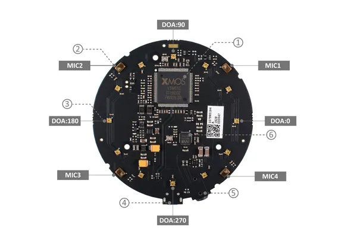

# reSpeaker USB Mic Array

**Seeed Studio** · Source collection

Revision: Unverified source identity  
Coverage: Source collection; review pending

[Browse all manufacturers](../../../../BROWSE.md) · [Devices & IoT](../../../../DEVICES.md) · [Open in the browser guide](https://valleytech-black-wire-guide.pages.dev/?board=source-board-862b85bf3d9027c3e4)

Device category: **Cameras & audio**

## Hardware Overview

**source reference** · Unreviewed source · JPG

[Open original reference](../../../../library/media/2245ac8da52c60af09763c60e6b7aa402e66089636821823f4c50c70e8a124b1.jpg)

**Credit and rights:** Source rights not yet established. Source/manufacturer: Seeed Studio.

[Source 1](https://files.seeedstudio.com/wiki/ReSpeaker-Mic-Array-v2.1/img/hardware_overview.jpg) · [Source 2](https://wiki.seeedstudio.com/ReSpeaker-USB-Mic-Array/)

Original source index: Hardware Overview. This file is searchable but has not been promoted to a reviewed physical board pinout.

Image revision: Not identified

SHA-256: `2245ac8da52c60af09763c60e6b7aa402e66089636821823f4c50c70e8a124b1`

Pin assignments have not been independently electrically verified. Check board revision before wiring.
