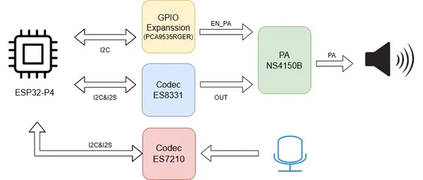
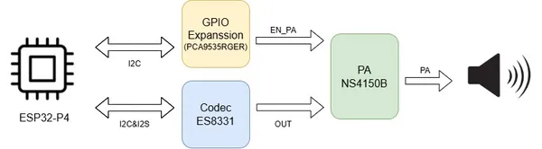
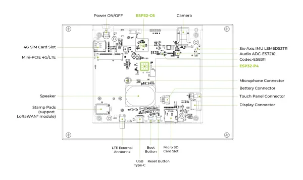

# reTerminal D1001

**Seeed Studio** · Source collection

Revision: Unverified source identity  
Coverage: Source collection; review pending

[Browse all manufacturers](../../../../BROWSE.md) · [Devices & IoT](../../../../DEVICES.md) · [Open in the browser guide](https://valleytech-black-wire-guide.pages.dev/?board=source-board-3fda0d79435e5e6385)

Device category: **Displays & HMI**

## Block Diagram (Microphone)

**source reference** · Unreviewed source · JPG

[Open original reference](../../../../library/media/651f8b1ec5d8bb169cee22e5e3222b37dbab34793e959c0dd5bbe8a0be3417a5.jpg)

**Credit and rights:** Source rights not yet established. Source/manufacturer: Seeed Studio.

[Source 1](https://files.seeedstudio.com/wiki/reTerminal_d10xx/Driving_Audio_Peripherals/microphone.jpg) · [Source 2](https://wiki.seeedstudio.com/driving_reterminal_d1001_microphone/)

Original source index: Block Diagram (Microphone). This file is searchable but has not been promoted to a reviewed physical board pinout.

Image revision: Not identified

SHA-256: `651f8b1ec5d8bb169cee22e5e3222b37dbab34793e959c0dd5bbe8a0be3417a5`

## Block Diagram (Speaker)

**source reference** · Unreviewed source · JPG

[Open original reference](../../../../library/media/ce972df3bc1de00a6609a9e17eb1ec6d173f69146c65c67bf275ec59abd86dbb.jpg)

**Credit and rights:** Source rights not yet established. Source/manufacturer: Seeed Studio.

[Source 1](https://files.seeedstudio.com/wiki/reTerminal_d10xx/Driving_Audio_Peripherals/D1001_Block_diagram.jpg) · [Source 2](https://wiki.seeedstudio.com/driving_reterminal_d1001_speaker/)

Original source index: Block Diagram (Speaker). This file is searchable but has not been promoted to a reviewed physical board pinout.

Image revision: Not identified

SHA-256: `ce972df3bc1de00a6609a9e17eb1ec6d173f69146c65c67bf275ec59abd86dbb`

## Hardware Overview

**source reference** · Unreviewed source · WEBP

[Open original reference](../../../../library/media/6bb3fbc1c444495446af6ea1d2320b155e0d4347c3005e8e234867a3feaf34d6.webp)

**Credit and rights:** Source rights not yet established. Source/manufacturer: Seeed Studio.

[Source 1](https://files.seeedstudio.com/wiki/reTerminal_d10xx/hardware.webp) · [Source 2](https://wiki.seeedstudio.com/getting_started_with_reterminal_d1001/)

Original source index: Hardware Overview. This file is searchable but has not been promoted to a reviewed physical board pinout.

Image revision: Not identified

SHA-256: `6bb3fbc1c444495446af6ea1d2320b155e0d4347c3005e8e234867a3feaf34d6`

Pin assignments have not been independently electrically verified. Check board revision before wiring.
