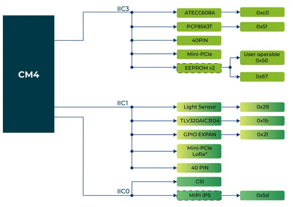
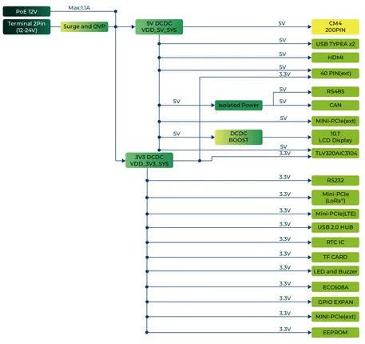
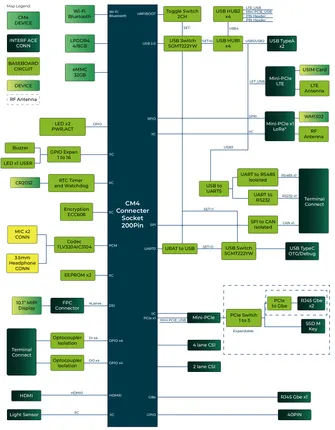
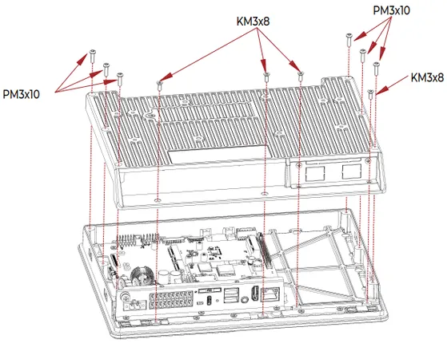
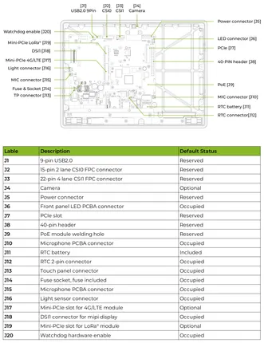
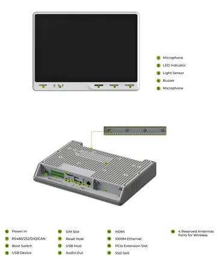

# reTerminal DM

**Seeed Studio** · Source collection

Revision: Unverified source identity  
Coverage: Source collection; review pending

[Browse all manufacturers](../../../../BROWSE.md) · [Desktop app](https://github.com/valleytechsolutions/black-wire-desktop)

## Block Diagram (I2C)

**source reference** · Unreviewed source · PNG

[Open original reference](../../../../library/media/32e7a24c8f721a1cd89e0f47feb3d0d20266024cfb63ba7a237db54142001952.png)

**Credit and rights:** Source rights not yet established. Source/manufacturer: Seeed Studio.

[Source 1](https://files.seeedstudio.com/wiki/reTerminalDM/interface/i2c-block.png) · [Source 2](https://wiki.seeedstudio.com/reterminal-dm/)

Original source index: Block Diagram (I2C). This file is searchable but has not been promoted to a reviewed physical board pinout.

SHA-256: `32e7a24c8f721a1cd89e0f47feb3d0d20266024cfb63ba7a237db54142001952`

## Block Diagram (Power)

**source reference** · Unreviewed source · PNG

[Open original reference](../../../../library/media/5673d8a9bc0fc96f6e991d6ae75a3ece5b627ea391a7b2750837d00460a21aac.png)

**Credit and rights:** Source rights not yet established. Source/manufacturer: Seeed Studio.

[Source 1](https://files.seeedstudio.com/wiki/reTerminalDM/interface/power-diagram.png) · [Source 2](https://wiki.seeedstudio.com/reterminal-dm/)

Original source index: Block Diagram (Power). This file is searchable but has not been promoted to a reviewed physical board pinout.

SHA-256: `5673d8a9bc0fc96f6e991d6ae75a3ece5b627ea391a7b2750837d00460a21aac`

## Block Diagram

**source reference** · Unreviewed source · PNG

[Open original reference](../../../../library/media/c311b78d003cc43818d549f3c3b233ef4fc7491d24b5f00fd00019e714542461.png)

**Credit and rights:** Source rights not yet established. Source/manufacturer: Seeed Studio.

[Source 1](https://files.seeedstudio.com/wiki/reTerminalDM/interface/block-diagram.png) · [Source 2](https://wiki.seeedstudio.com/reterminal-dm/)

Original source index: Block Diagram. This file is searchable but has not been promoted to a reviewed physical board pinout.

SHA-256: `c311b78d003cc43818d549f3c3b233ef4fc7491d24b5f00fd00019e714542461`

## Dimensions

**source reference** · Unreviewed source · PNG

[Open original reference](../../../../library/media/9891d2f4846fd419248cf0f40f851a3f11f053468a299794d6e8d4d8df483bb0.png)

**Credit and rights:** Source rights not yet established. Source/manufacturer: Seeed Studio.

[Source 1](https://files.seeedstudio.com/wiki/reTerminalDM/hardware/back_screw.png) · [Source 2](https://wiki.seeedstudio.com/reterminal-dm-hardware-guide/)

Original source index: Dimensions. This file is searchable but has not been promoted to a reviewed physical board pinout.

SHA-256: `9891d2f4846fd419248cf0f40f851a3f11f053468a299794d6e8d4d8df483bb0`

## Hardware Overview (Inside)

**source reference** · Unreviewed source · PNG

[Open original reference](../../../../library/media/a86b88135f12dd37282ef8b94c99b97d559a2ecccb19d69a462a061b98da737b.png)

**Credit and rights:** Source rights not yet established. Source/manufacturer: Seeed Studio.

[Source 1](https://files.seeedstudio.com/wiki/reTerminalDM/interface/Mainboard.png) · [Source 2](https://wiki.seeedstudio.com/reterminal-dm/)

Original source index: Hardware Overview (Inside). This file is searchable but has not been promoted to a reviewed physical board pinout.

SHA-256: `a86b88135f12dd37282ef8b94c99b97d559a2ecccb19d69a462a061b98da737b`

## Hardware Overview

**source reference** · Unreviewed source · PNG

[Open original reference](../../../../library/media/9348ad2e2b9e7847cc54f859ef0884d97bc2d1bed66b9830426f2941761007d9.png)

**Credit and rights:** Source rights not yet established. Source/manufacturer: Seeed Studio.

[Source 1](https://files.seeedstudio.com/wiki/reTerminalDM/interface/interface-overview.png) · [Source 2](https://wiki.seeedstudio.com/reterminal-dm/)

Original source index: Hardware Overview. This file is searchable but has not been promoted to a reviewed physical board pinout.

SHA-256: `9348ad2e2b9e7847cc54f859ef0884d97bc2d1bed66b9830426f2941761007d9`

Pin assignments have not been independently electrically verified. Check board revision before wiring.
