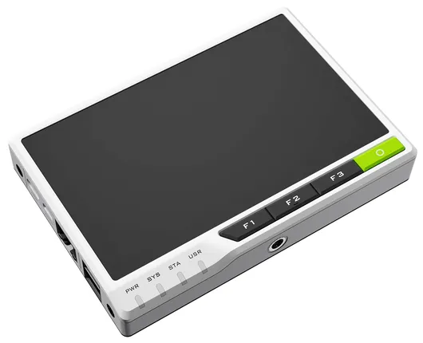
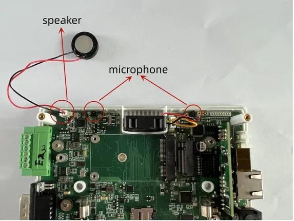
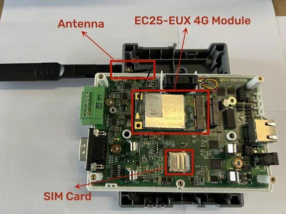

# reTerminal E10-1

**Seeed Studio** · Source collection

Revision: Unverified source identity  
Coverage: Source collection; review pending

[Browse all manufacturers](../../../../BROWSE.md) · [Devices & IoT](../../../../DEVICES.md) · [Open in the browser guide](https://valleytech-black-wire-guide.pages.dev/?board=source-board-4a9c04e448c0594475)

Device category: **Displays & HMI**

## Hardware Overview (Side)

**source reference** · Unreviewed source · PNG

[Open original reference](../../../../library/media/4d0b13e0db734477daa11d06dab3debcf8ec6cf05bc02221bf2c484973377d71.png)

**Credit and rights:** Source rights not yet established. Source/manufacturer: Seeed Studio.

[Source 1](https://files.seeedstudio.com/wiki/ReTerminal/wiki_thumb.png) · [Source 2](https://wiki.seeedstudio.com/reTerminalBridge/)

Original source index: Hardware Overview (Side). This file is searchable but has not been promoted to a reviewed physical board pinout.

Image revision: Not identified

SHA-256: `4d0b13e0db734477daa11d06dab3debcf8ec6cf05bc02221bf2c484973377d71`

## Hardware Overview 2

**source reference** · Unreviewed source · JPG

[Open original reference](../../../../library/media/5d657199f979d7831cdd76a94368be60fb8f7856f1a423a1fe4343caa6cafb4a.jpg)

**Credit and rights:** Source rights not yet established. Source/manufacturer: Seeed Studio.

[Source 1](https://files.seeedstudio.com/wiki/reTerminal_Bridge/028.jpg) · [Source 2](https://wiki.seeedstudio.com/reTerminalBridge/)

Original source index: Hardware Overview 2. This file is searchable but has not been promoted to a reviewed physical board pinout.

Image revision: Not identified

SHA-256: `5d657199f979d7831cdd76a94368be60fb8f7856f1a423a1fe4343caa6cafb4a`

## Hardware Overview

**source reference** · Unreviewed source · JPG

[Open original reference](../../../../library/media/6ef3d0a1758220ad0c9f81bd0cc4e1ae79279b7d1c22b63619c83b798fb39454.jpg)

**Credit and rights:** Source rights not yet established. Source/manufacturer: Seeed Studio.

[Source 1](https://files.seeedstudio.com/wiki/reTerminal_Bridge/042.jpg) · [Source 2](https://wiki.seeedstudio.com/reTerminalBridge/)

Original source index: Hardware Overview. This file is searchable but has not been promoted to a reviewed physical board pinout.

Image revision: Not identified

SHA-256: `6ef3d0a1758220ad0c9f81bd0cc4e1ae79279b7d1c22b63619c83b798fb39454`

Pin assignments have not been independently electrically verified. Check board revision before wiring.
