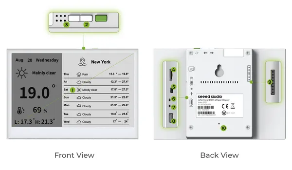

# reTerminal E1001

**Seeed Studio** · Source collection

Revision: Unverified source identity  
Coverage: Source collection; review pending

[Browse all manufacturers](../../../../BROWSE.md) · [Devices & IoT](../../../../DEVICES.md) · [Open in the browser guide](https://valleytech-black-wire-guide.pages.dev/?board=source-board-affe34611e23a71386)

Device category: **Displays & HMI**

## Hardware Overview

**source reference** · Unreviewed source · PNG

[Open original reference](../../../../library/media/49ba5ebe8b7a2f38363561e250faedb3b26f342161f9fe06b290bf49741eaba8.png)

**Credit and rights:** Source rights not yet established. Source/manufacturer: Seeed Studio.

[Source 1](https://files.seeedstudio.com/wiki/reterminal_e10xx/img/150.png) · [Source 2](https://wiki.seeedstudio.com/getting_started_with_reterminal_e1001/)

Original source index: Hardware Overview. This file is searchable but has not been promoted to a reviewed physical board pinout.

Image revision: Not identified

SHA-256: `49ba5ebe8b7a2f38363561e250faedb3b26f342161f9fe06b290bf49741eaba8`

Pin assignments have not been independently electrically verified. Check board revision before wiring.
