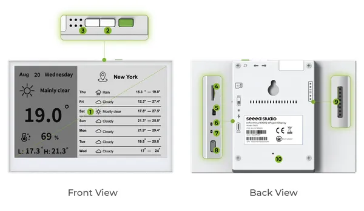

# reTerminal E1002

**Seeed Studio** · Source collection

Revision: Unverified source identity  
Coverage: Source collection; review pending

[Browse all manufacturers](../../../../BROWSE.md) · [Devices & IoT](../../../../DEVICES.md) · [Open in the browser guide](https://valleytech-black-wire-guide.pages.dev/?board=source-board-3c0a71f5bc3d7061d7)

Device category: **Displays & HMI**

## Hardware Overview

**source reference** · Unreviewed source · PNG

[Open original reference](../../../../library/media/19f1e0373d7b2c75293af2b219c3534895650c2f86619fbaca2d9cf8c37ddc96.png)

**Credit and rights:** Source rights not yet established. Source/manufacturer: Seeed Studio.

[Source 1](https://files.seeedstudio.com/wiki/reterminal_e10xx/img/207.png) · [Source 2](https://wiki.seeedstudio.com/getting_started_with_reterminal_e1002/)

Original source index: Hardware Overview. This file is searchable but has not been promoted to a reviewed physical board pinout.

Image revision: Not identified

SHA-256: `19f1e0373d7b2c75293af2b219c3534895650c2f86619fbaca2d9cf8c37ddc96`

Pin assignments have not been independently electrically verified. Check board revision before wiring.
