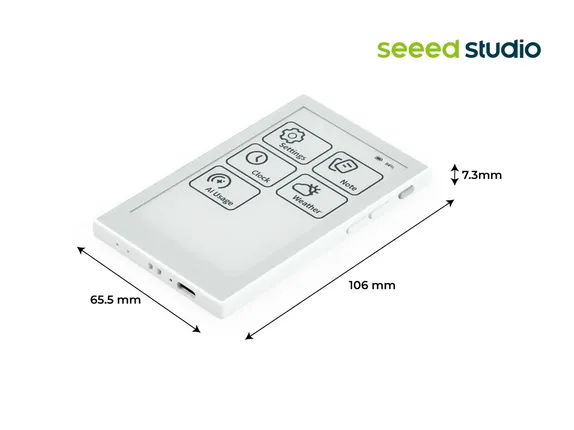

# reTerminal Sticky

**Seeed Studio** · Source collection

Revision: Unverified source identity  
Coverage: Source collection; review pending

[Browse all manufacturers](../../../../BROWSE.md) · [Devices & IoT](../../../../DEVICES.md) · [Open in the browser guide](https://valleytech-black-wire-guide.pages.dev/?board=source-board-b6f74353d0de2230ed)

Device category: **Displays & HMI**

## Dimensions

**source reference** · Unreviewed source · JPG

[Open original reference](../../../../library/media/e3a53c1cfabf18b630a687eed86e0889f772dd604669e80295356de2d0127297.jpg)

**Credit and rights:** Source rights not yet established. Source/manufacturer: Seeed Studio.

[Source 1](https://media-cdn.seeedstudio.com/media/catalog/product/1/0/100056818-gallery_img_9_1.jpg) · [Source 2](https://www.seeedstudio.com/reTerminal-Sticky-p-6861.html)

Original source index: Dimensions. This file is searchable but has not been promoted to a reviewed physical board pinout.

Image revision: Not identified

SHA-256: `e3a53c1cfabf18b630a687eed86e0889f772dd604669e80295356de2d0127297`

Pin assignments have not been independently electrically verified. Check board revision before wiring.
