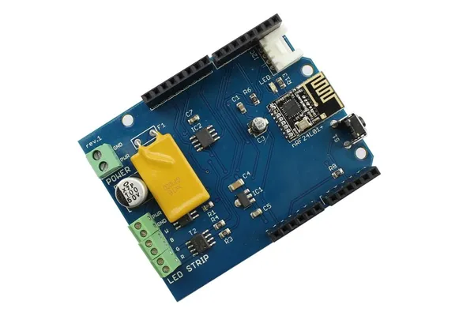

# RGBW Stripe Wireless Shield V1.0

**Seeed Studio** · Source collection

Revision: Unverified source identity  
Coverage: Source collection; review pending

[Browse all manufacturers](../../../../BROWSE.md) · [Desktop app](https://github.com/valleytechsolutions/black-wire-desktop)

## Hardware Overview (Front)

**source reference** · Unreviewed source · JPG

[Open original reference](../../../../library/media/4efec1d259f6e9a0c201737b8268dd14278d83eb7453ac30f8e3890dc2b083f3.jpg)

**Credit and rights:** Source rights not yet established. Source/manufacturer: Seeed Studio.

[Source 1](https://files.seeedstudio.com/wiki/RGBW_Stripe_WireLess_Shield_V1.0/img/RGBW_rev1_face.jpg) · [Source 2](https://wiki.seeedstudio.com/RGBW_Stripe_WireLess_Shield_V1.0/)

Original source index: Hardware Overview (Front). This file is searchable but has not been promoted to a reviewed physical board pinout.

SHA-256: `4efec1d259f6e9a0c201737b8268dd14278d83eb7453ac30f8e3890dc2b083f3`

Pin assignments have not been independently electrically verified. Check board revision before wiring.
