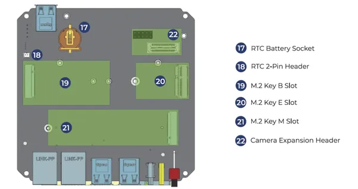
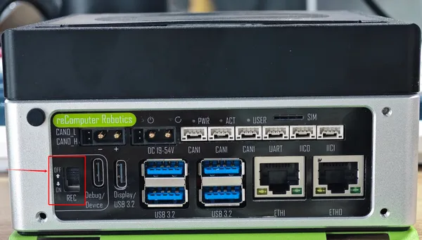
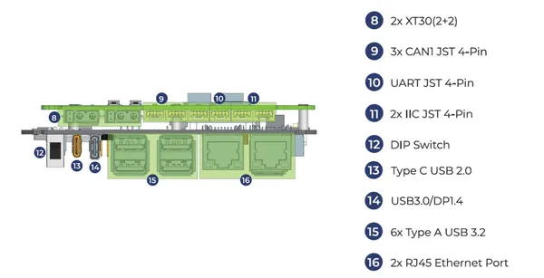
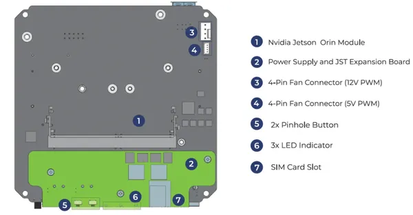
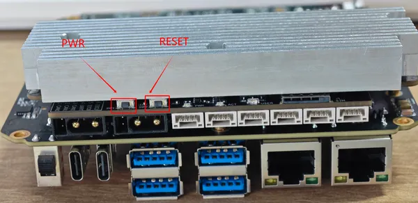
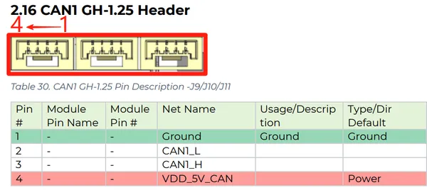

# Robotics J401 Carrier Board

**Seeed Studio** · Source collection

Revision: Unverified source identity  
Coverage: Source collection; review pending

[Browse all manufacturers](../../../../BROWSE.md) · [Desktop app](https://github.com/valleytechsolutions/black-wire-desktop)

## Hardware Overview (Bottom)

**source reference** · Unreviewed source · PNG

[Open original reference](../../../../library/media/460875552735deac00f1268e62bc9836b1d42b26f86b5879ee3b58814201f426.png)

**Credit and rights:** Source rights not yet established. Source/manufacturer: Seeed Studio.

Original source index: Hardware Overview (Bottom). This file is searchable but has not been promoted to a reviewed physical board pinout.

SHA-256: `460875552735deac00f1268e62bc9836b1d42b26f86b5879ee3b58814201f426`

## Hardware Overview (Front)

**source reference** · Unreviewed source · JPG

[Open original reference](../../../../library/media/6a93874b9744e394be677830ac892bcca71487d307858b02afcf3874c6a4a3d5.jpg)

**Credit and rights:** Source rights not yet established. Source/manufacturer: Seeed Studio.

[Source 1](https://files.seeedstudio.com/wiki/reComputer-Jetson/robotics_j401/debug.jpg) · [Source 2](https://wiki.seeedstudio.com/recomputer_jetson_robotics_j401_getting_started/)

Original source index: Hardware Overview (Front). This file is searchable but has not been promoted to a reviewed physical board pinout.

SHA-256: `6a93874b9744e394be677830ac892bcca71487d307858b02afcf3874c6a4a3d5`

## Hardware Overview (Front)

**source reference** · Unreviewed source · PNG

[Open original reference](../../../../library/media/a2fae86cb9b042fda27ed4d4da5b862ee232c59c14c3d054fda01e820bce8fcf.png)

**Credit and rights:** Source rights not yet established. Source/manufacturer: Seeed Studio.

Original source index: Hardware Overview (Front). This file is searchable but has not been promoted to a reviewed physical board pinout.

SHA-256: `a2fae86cb9b042fda27ed4d4da5b862ee232c59c14c3d054fda01e820bce8fcf`

## Hardware Overview (Top)

**source reference** · Unreviewed source · PNG

[Open original reference](../../../../library/media/1cbf62e2eba6f7b582003319ea3bc995f7b8fd0c358f87d01e2224ba938a8e44.png)

**Credit and rights:** Source rights not yet established. Source/manufacturer: Seeed Studio.

Original source index: Hardware Overview (Top). This file is searchable but has not been promoted to a reviewed physical board pinout.

SHA-256: `1cbf62e2eba6f7b582003319ea3bc995f7b8fd0c358f87d01e2224ba938a8e44`

## Hardware Overview

**source reference** · Unreviewed source · JPG

[Open original reference](../../../../library/media/d5486081e216748214d994e1016b667f96f98c81be13d2e427c858d7fc8a3d0e.jpg)

**Credit and rights:** Source rights not yet established. Source/manufacturer: Seeed Studio.

[Source 1](https://files.seeedstudio.com/wiki/reComputer-Jetson/robotics_j401/pinhole_button.jpg) · [Source 2](https://wiki.seeedstudio.com/recomputer_jetson_robotics_j401_getting_started/)

Original source index: Hardware Overview. This file is searchable but has not been promoted to a reviewed physical board pinout.

SHA-256: `d5486081e216748214d994e1016b667f96f98c81be13d2e427c858d7fc8a3d0e`

## Pin Definition Table (CAN1 Header)

**source reference** · Unreviewed source · PNG

[Open original reference](../../../../library/media/1501e8d95049622c340dd8295fc63c25b153be5c5d2baa62cfb4ac78fde9c0d7.png)

**Credit and rights:** Source rights not yet established. Source/manufacturer: Seeed Studio.

Original source index: Pin Definition Table (CAN1 Header). This file is searchable but has not been promoted to a reviewed physical board pinout.

SHA-256: `1501e8d95049622c340dd8295fc63c25b153be5c5d2baa62cfb4ac78fde9c0d7`

Pin assignments have not been independently electrically verified. Check board revision before wiring.
