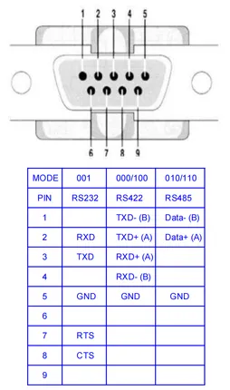
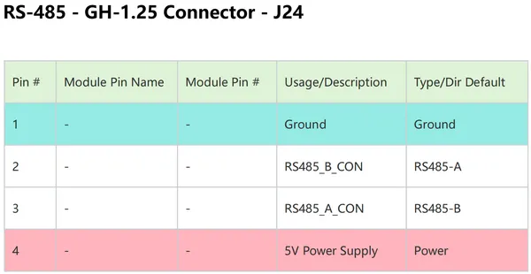

# Robotics J601 Carrier Board

**Seeed Studio** · Source collection

Revision: Unverified source identity  
Coverage: Source collection; review pending

[Browse all manufacturers](../../../../BROWSE.md) · [Desktop app](https://github.com/valleytechsolutions/black-wire-desktop)

## Pin Definition Table (DB9 RS232-RS422-RS485)

**source reference** · Unreviewed source · PNG

[Open original reference](../../../../library/media/47113be38d8fe05f4f8e4861086d0ec3f0a2eaa9240371adf19db19a380cbaa4.png)

**Credit and rights:** Source rights not yet established. Source/manufacturer: Seeed Studio.

Original source index: Pin Definition Table (DB9 RS232-RS422-RS485). This file is searchable but has not been promoted to a reviewed physical board pinout.

SHA-256: `47113be38d8fe05f4f8e4861086d0ec3f0a2eaa9240371adf19db19a380cbaa4`

## Pin Definition Table (RS-485 Connector)

**source reference** · Unreviewed source · PNG

[Open original reference](../../../../library/media/bcdcd9936ea1246fe6134512ddce2d75f4b88959874f547df101d7e7ef7e2f9b.png)

**Credit and rights:** Source rights not yet established. Source/manufacturer: Seeed Studio.

Original source index: Pin Definition Table (RS-485 Connector). This file is searchable but has not been promoted to a reviewed physical board pinout.

SHA-256: `bcdcd9936ea1246fe6134512ddce2d75f4b88959874f547df101d7e7ef7e2f9b`

Pin assignments have not been independently electrically verified. Check board revision before wiring.
