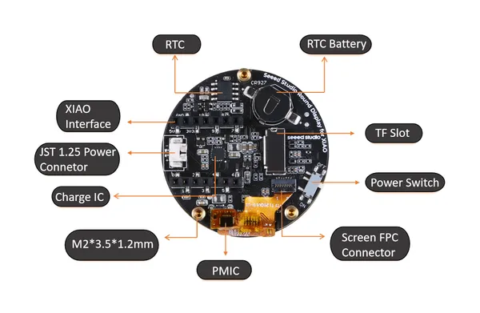
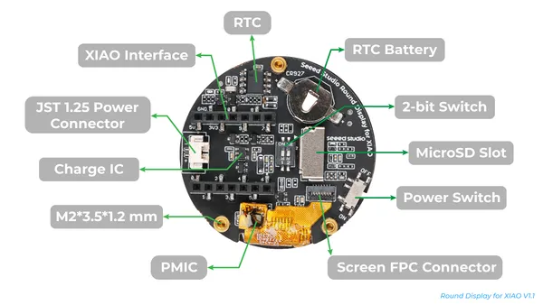
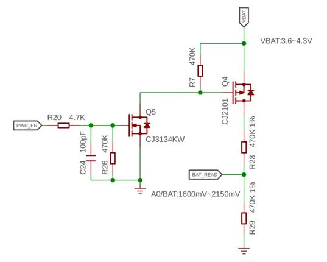
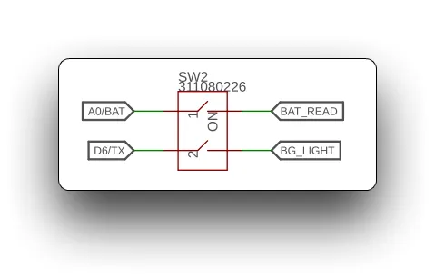
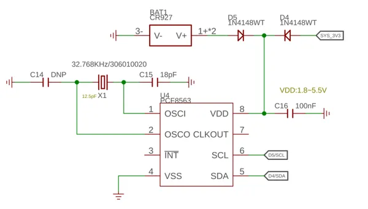
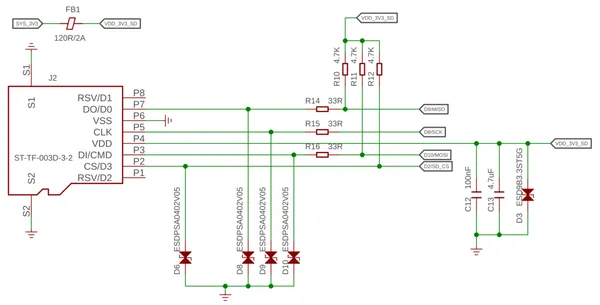
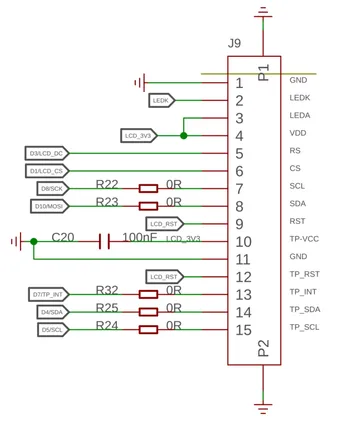

# Round Display for XIAO

**Seeed Studio** · Source collection

Revision: Unverified source identity  
Coverage: Source collection; review pending

[Browse all manufacturers](../../../../BROWSE.md) · [Desktop app](https://github.com/valleytechsolutions/black-wire-desktop)

## Hardware Overview (v1.0)

**source reference** · Unreviewed source · PNG

[Open original reference](../../../../library/media/f3178ff5624b8f0cac8013595685a04f33e2978e4d6b2f9628810fa2e6cc8271.png)

**Credit and rights:** Source rights not yet established. Source/manufacturer: Seeed Studio.

[Source 1](https://files.seeedstudio.com/wiki/round_display_for_xiao/round-pinout.png) · [Source 2](https://wiki.seeedstudio.com/get_start_round_display/)

Original source index: Hardware Overview (v1.0). This file is searchable but has not been promoted to a reviewed physical board pinout.

SHA-256: `f3178ff5624b8f0cac8013595685a04f33e2978e4d6b2f9628810fa2e6cc8271`

## Hardware Overview (v1.1)

**source reference** · Unreviewed source · PNG

[Open original reference](../../../../library/media/ec5de043a4e020889b3c41eddc21b9055d864633e4488b9bac9426e0e182d819.png)

**Credit and rights:** Source rights not yet established. Source/manufacturer: Seeed Studio.

[Source 1](https://files.seeedstudio.com/wiki/round_display_for_xiao/round-display-v1.1-pinout.png) · [Source 2](https://wiki.seeedstudio.com/get_start_round_display/)

Original source index: Hardware Overview (v1.1). This file is searchable but has not been promoted to a reviewed physical board pinout.

SHA-256: `ec5de043a4e020889b3c41eddc21b9055d864633e4488b9bac9426e0e182d819`

## Pin Functions (Battery Voltage)

**source reference** · Unreviewed source · PNG

[Open original reference](../../../../library/media/add0b09fe8337e96d45b19ee877759836c527ae40a132c4640d7cedfe7d51494.png)

**Credit and rights:** Source rights not yet established. Source/manufacturer: Seeed Studio.

[Source 1](https://files.seeedstudio.com/wiki/round_display_for_xiao/70.png) · [Source 2](https://wiki.seeedstudio.com/seeedstudio_round_display_usage/)

Original source index: Pin Functions (Battery Voltage). This file is searchable but has not been promoted to a reviewed physical board pinout.

SHA-256: `add0b09fe8337e96d45b19ee877759836c527ae40a132c4640d7cedfe7d51494`

## Pin Functions (KE Switch)

**source reference** · Unreviewed source · PNG

[Open original reference](../../../../library/media/3ea28eb7ebd745f629718c03e63c9d114865da2bf04e2027123ec006e989f8e4.png)

**Credit and rights:** Source rights not yet established. Source/manufacturer: Seeed Studio.

[Source 1](https://files.seeedstudio.com/wiki/round_display_for_xiao/91.png) · [Source 2](https://wiki.seeedstudio.com/seeedstudio_round_display_usage/)

Original source index: Pin Functions (KE Switch). This file is searchable but has not been promoted to a reviewed physical board pinout.

SHA-256: `3ea28eb7ebd745f629718c03e63c9d114865da2bf04e2027123ec006e989f8e4`

## Pin Functions (RTC)

**source reference** · Unreviewed source · PNG

[Open original reference](../../../../library/media/f66e84255de8780d6ba1a1bc8b31552424babba9dbcdda7589d910112b85947e.png)

**Credit and rights:** Source rights not yet established. Source/manufacturer: Seeed Studio.

[Source 1](https://files.seeedstudio.com/wiki/round_display_for_xiao/68.png) · [Source 2](https://wiki.seeedstudio.com/seeedstudio_round_display_usage/)

Original source index: Pin Functions (RTC). This file is searchable but has not been promoted to a reviewed physical board pinout.

SHA-256: `f66e84255de8780d6ba1a1bc8b31552424babba9dbcdda7589d910112b85947e`

## Pin Functions (SD Card)

**source reference** · Unreviewed source · PNG

[Open original reference](../../../../library/media/9a8f371fbabc9e274e3f78751ddcbfc3ffad98556c912df58989e6c804e3cbae.png)

**Credit and rights:** Source rights not yet established. Source/manufacturer: Seeed Studio.

[Source 1](https://files.seeedstudio.com/wiki/round_display_for_xiao/67.png) · [Source 2](https://wiki.seeedstudio.com/seeedstudio_round_display_usage/)

Original source index: Pin Functions (SD Card). This file is searchable but has not been promoted to a reviewed physical board pinout.

SHA-256: `9a8f371fbabc9e274e3f78751ddcbfc3ffad98556c912df58989e6c804e3cbae`

## Pin Functions (Touch Screen)

**source reference** · Unreviewed source · PNG

[Open original reference](../../../../library/media/81fbdda1f13e17b6b710e9dca9c5249465e7dbe560a90fb2abe7904a065f2d82.png)

**Credit and rights:** Source rights not yet established. Source/manufacturer: Seeed Studio.

[Source 1](https://files.seeedstudio.com/wiki/round_display_for_xiao/69.png) · [Source 2](https://wiki.seeedstudio.com/seeedstudio_round_display_usage/)

Original source index: Pin Functions (Touch Screen). This file is searchable but has not been promoted to a reviewed physical board pinout.

SHA-256: `81fbdda1f13e17b6b710e9dca9c5249465e7dbe560a90fb2abe7904a065f2d82`

Pin assignments have not been independently electrically verified. Check board revision before wiring.
