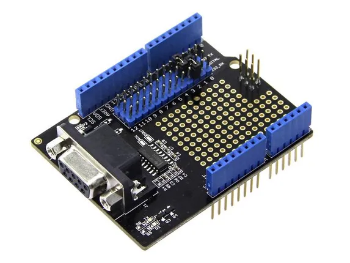

# RS232 Shield

**Seeed Studio** · Source collection

Revision: Unverified source identity  
Coverage: Source collection; review pending

[Browse all manufacturers](../../../../BROWSE.md) · [Desktop app](https://github.com/valleytechsolutions/black-wire-desktop)

## Hardware Overview (Front)

**source reference** · Unreviewed source · JPG

[Open original reference](../../../../library/media/e108ea9effeaa3ebae6de29317ec6ad0c81024357ad73f8900c5ab6a639177a4.jpg)

**Credit and rights:** Source rights not yet established. Source/manufacturer: Seeed Studio.

[Source 1](https://files.seeedstudio.com/wiki/RS232_Shield/img/RS232_Shield_Photo.jpg) · [Source 2](https://wiki.seeedstudio.com/RS232_Shield/)

Original source index: Hardware Overview (Front). This file is searchable but has not been promoted to a reviewed physical board pinout.

SHA-256: `e108ea9effeaa3ebae6de29317ec6ad0c81024357ad73f8900c5ab6a639177a4`

Pin assignments have not been independently electrically verified. Check board revision before wiring.
