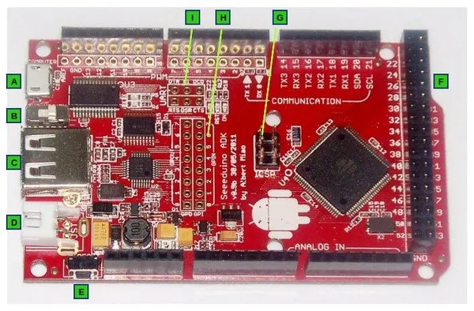

# Seeeduino ADK Main Board

**Seeed Studio** · Source collection

Revision: Unverified source identity  
Coverage: Source collection; review pending

[Browse all manufacturers](../../../../BROWSE.md) · [Desktop app](https://github.com/valleytechsolutions/black-wire-desktop)

## Hardware Overview

**source reference** · Unreviewed source · JPG

[Open original reference](../../../../library/media/fc4671e95582bd833bd7b7f941c91ee0f8cd88df1057a54880ee6a6de44a41b5.jpg)

**Credit and rights:** Source rights not yet established. Source/manufacturer: Seeed Studio.

[Source 1](https://files.seeedstudio.com/wiki/Seeeduino-ADK_Main_Board/img/Seeeduino_ADK_Parts.jpg) · [Source 2](https://wiki.seeedstudio.com/Seeeduino_ADK_Main_Board/)

Original source index: Hardware Overview. This file is searchable but has not been promoted to a reviewed physical board pinout.

SHA-256: `fc4671e95582bd833bd7b7f941c91ee0f8cd88df1057a54880ee6a6de44a41b5`

Pin assignments have not been independently electrically verified. Check board revision before wiring.
