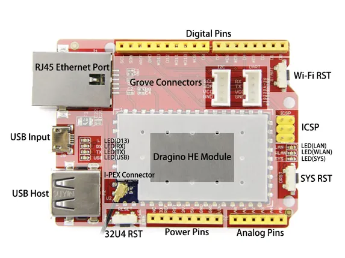

# Seeeduino Cloud

**Seeed Studio** · Source collection

Revision: Unverified source identity  
Coverage: Source collection; review pending

[Browse all manufacturers](../../../../BROWSE.md) · [Desktop app](https://github.com/valleytechsolutions/black-wire-desktop)

## Hardware Overview

**source reference** · Unreviewed source · PNG

[Open original reference](../../../../library/media/6aaf9bf77c17b667fea5495a95cdc0d2ce412a795f0863264757f3ab813962d3.png)

**Credit and rights:** Source rights not yet established. Source/manufacturer: Seeed Studio.

[Source 1](https://files.seeedstudio.com/wiki/Seeeduino_Cloud/img/seeeduino_cloud_hardware.png) · [Source 2](https://wiki.seeedstudio.com/Seeeduino_Cloud/)

Original source index: Hardware Overview. This file is searchable but has not been promoted to a reviewed physical board pinout.

SHA-256: `6aaf9bf77c17b667fea5495a95cdc0d2ce412a795f0863264757f3ab813962d3`

Pin assignments have not been independently electrically verified. Check board revision before wiring.
