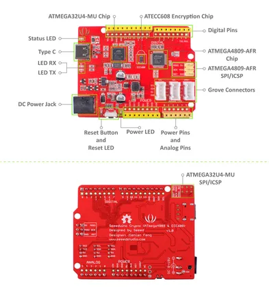

# Seeeduino Crypto (ATmega4809 ECC608)

**Seeed Studio** · Source collection

Revision: Unverified source identity  
Coverage: Source collection; review pending

[Browse all manufacturers](../../../../BROWSE.md) · [Desktop app](https://github.com/valleytechsolutions/black-wire-desktop)

## Hardware Overview

**source reference** · Unreviewed source · JPG

[Open original reference](../../../../library/media/055ce5dee0cdab317912ab4b9d99400a2aa25aca214e438ef63f5671e2740867.jpg)

**Credit and rights:** Source rights not yet established. Source/manufacturer: Seeed Studio.

[Source 1](https://files.seeedstudio.com/wiki/Seeeduino-Crypto-ATmega4809-ECC608-/img/Hardware-figure.jpg) · [Source 2](https://wiki.seeedstudio.com/Seeeduino-Crypto-ATmega4809-ECC608/)

Original source index: Hardware Overview. This file is searchable but has not been promoted to a reviewed physical board pinout.

SHA-256: `055ce5dee0cdab317912ab4b9d99400a2aa25aca214e438ef63f5671e2740867`

Pin assignments have not been independently electrically verified. Check board revision before wiring.
