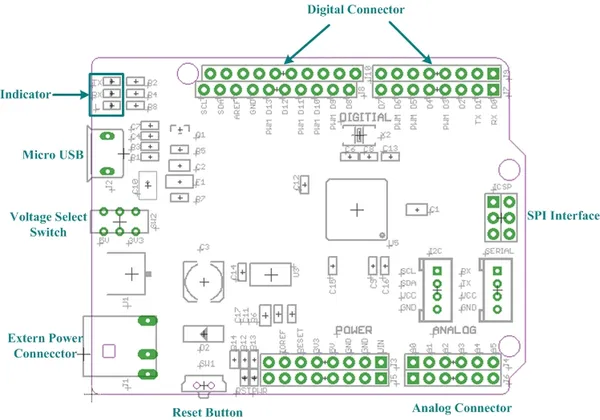

# Seeeduino Lite

**Seeed Studio** · Source collection

Revision: Unverified source identity  
Coverage: Source collection; review pending

[Browse all manufacturers](../../../../BROWSE.md) · [Desktop app](https://github.com/valleytechsolutions/black-wire-desktop)

## Interfaces

**source reference** · Unreviewed source · JPG

[Open original reference](../../../../library/media/6d12e7810d844b2327e548751a97d3400d59f2a42f7c3ca274861d92b0ad3adb.jpg)

**Credit and rights:** Source rights not yet established. Source/manufacturer: Seeed Studio.

[Source 1](https://files.seeedstudio.com/wiki/Seeeduino_Lite/image/Seeeduino_Lite_Intrface_Function.jpg) · [Source 2](https://wiki.seeedstudio.com/Seeeduino_Lite/)

Original source index: Interfaces. This file is searchable but has not been promoted to a reviewed physical board pinout.

SHA-256: `6d12e7810d844b2327e548751a97d3400d59f2a42f7c3ca274861d92b0ad3adb`

Pin assignments have not been independently electrically verified. Check board revision before wiring.
