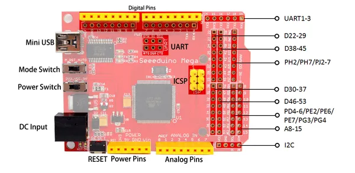

# Seeeduino Mega

**Seeed Studio** · Source collection

Revision: Unverified source identity  
Coverage: Source collection; review pending

[Browse all manufacturers](../../../../BROWSE.md) · [Desktop app](https://github.com/valleytechsolutions/black-wire-desktop)

## Hardware Overview

**source reference** · Unreviewed source · PNG

[Open original reference](../../../../library/media/c02343014de9acb595f405e52002269bcad513f82a1ad8ea23f93a99371bd251.png)

**Credit and rights:** Source rights not yet established. Source/manufacturer: Seeed Studio.

[Source 1](https://files.seeedstudio.com/wiki/Seeeduino_Mega/img/Seeeduino_Mega_hardware1.png) · [Source 2](https://wiki.seeedstudio.com/Seeeduino_Mega/)

Original source index: Hardware Overview. This file is searchable but has not been promoted to a reviewed physical board pinout.

SHA-256: `c02343014de9acb595f405e52002269bcad513f82a1ad8ea23f93a99371bd251`

## Pin Definition

**source reference** · Unreviewed source · PDF

[Open original reference](../../../../library/media/98feb00c4eeb9efac6dd5e8ea1d561bbff4c78ec801bbae0d51c15eee04fb5df.pdf)

**Credit and rights:** Source rights not yet established. Source/manufacturer: Seeed Studio.

[Source 1](https://files.seeedstudio.com/wiki/Seeeduino_Mega/res/Seeeduino%20Mega%20pin%20mapping.pdf) · [Source 2](https://wiki.seeedstudio.com/Seeeduino_Mega/)

Original source index: Pin Definition. This file is searchable but has not been promoted to a reviewed physical board pinout.

SHA-256: `98feb00c4eeb9efac6dd5e8ea1d561bbff4c78ec801bbae0d51c15eee04fb5df`

Pin assignments have not been independently electrically verified. Check board revision before wiring.
