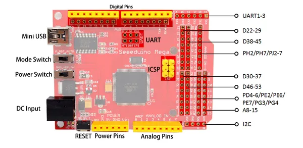

# Seeeduino Mega

**Seeed Studio** · Source collection

Revision: Unverified source identity

Coverage: Source collection; review pending

[Browse all manufacturers](../../../../BROWSE.md) · [Devices & IoT](../../../../DEVICES.md) · [Open in the browser guide](https://valleytech-black-wire-guide.pages.dev/?board=source-board-3c45046ee247bf482f)

## Datasheets and original documentation

Board datasheet: **not yet recorded**. Visual reference: **available**.

[Manufacturer source (recorded link)](https://wiki.seeedstudio.com/Seeeduino_Mega/)

A chip datasheet, schematic and board datasheet have different scopes. Match the exact hardware revision.

[Documentation coverage and remaining gaps](../../../../DOCUMENTATION.md)

## Hardware Overview

**source reference** · Unreviewed source · PNG

[Open original reference](../../../../library/media/c02343014de9acb595f405e52002269bcad513f82a1ad8ea23f93a99371bd251.png)

**Credit and rights:** Source rights not yet established. Source/manufacturer: Seeed Studio.

[Source 1](https://files.seeedstudio.com/wiki/Seeeduino_Mega/img/Seeeduino_Mega_hardware1.png) · [Source 2](https://wiki.seeedstudio.com/Seeeduino_Mega/)

Original source index: Hardware Overview. This file is searchable but has not been promoted to a reviewed physical board pinout.

Image revision: Not identified

SHA-256: `c02343014de9acb595f405e52002269bcad513f82a1ad8ea23f93a99371bd251`

## Pin Definition

**source reference** · Unreviewed source · PDF

[Open original reference](../../../../library/media/98feb00c4eeb9efac6dd5e8ea1d561bbff4c78ec801bbae0d51c15eee04fb5df.pdf)

**Credit and rights:** Source rights not yet established. Source/manufacturer: Seeed Studio.

[Source 1](https://files.seeedstudio.com/wiki/Seeeduino_Mega/res/Seeeduino%20Mega%20pin%20mapping.pdf) · [Source 2](https://wiki.seeedstudio.com/Seeeduino_Mega/)

Original source index: Pin Definition. This file is searchable but has not been promoted to a reviewed physical board pinout.

Image revision: Not identified

SHA-256: `98feb00c4eeb9efac6dd5e8ea1d561bbff4c78ec801bbae0d51c15eee04fb5df`

Pin assignments have not been independently electrically verified. Check board revision before wiring.
