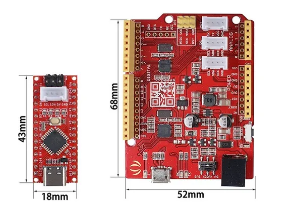
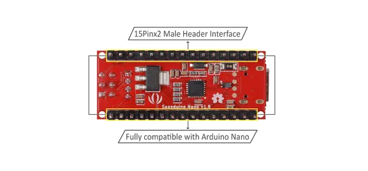
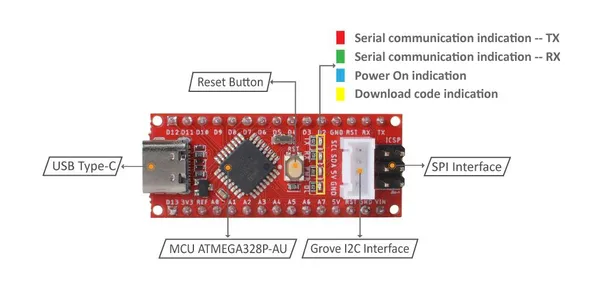

# Seeeduino Nano

**Seeed Studio** · Source collection

Revision: Unverified source identity  
Coverage: Source collection; review pending

[Browse all manufacturers](../../../../BROWSE.md) · [Desktop app](https://github.com/valleytechsolutions/black-wire-desktop)

## Dimensions

**source reference** · Unreviewed source · JPG

[Open original reference](../../../../library/media/fda29649818b56860f93e2535fa198dd5661f8e0af01bdc9504be3f8d4d4eb72.jpg)

**Credit and rights:** Source rights not yet established. Source/manufacturer: Seeed Studio.

[Source 1](https://files.seeedstudio.com/wiki/Seeeduino-Nano/img/seeeduino-Nano-compare-2.jpg) · [Source 2](https://wiki.seeedstudio.com/Seeeduino-Nano/)

Original source index: Dimensions. This file is searchable but has not been promoted to a reviewed physical board pinout.

SHA-256: `fda29649818b56860f93e2535fa198dd5661f8e0af01bdc9504be3f8d4d4eb72`

## Hardware Overview (Back)

**source reference** · Unreviewed source · PNG

[Open original reference](../../../../library/media/6ff1723fc1c12bde93873db454981c79713252d8ff98e734090b3bd9cd73eedd.png)

**Credit and rights:** Source rights not yet established. Source/manufacturer: Seeed Studio.

[Source 1](https://files.seeedstudio.com/wiki/Seeeduino-Nano/img/pinout-2.png) · [Source 2](https://wiki.seeedstudio.com/Seeeduino-Nano/)

Original source index: Hardware Overview (Back). This file is searchable but has not been promoted to a reviewed physical board pinout.

SHA-256: `6ff1723fc1c12bde93873db454981c79713252d8ff98e734090b3bd9cd73eedd`

## Hardware Overview (Front)

**source reference** · Unreviewed source · JPG

[Open original reference](../../../../library/media/06bd9fe37594945a6be2cd6dbfc7b370364e56da2091bc122b38b7caf442697b.jpg)

**Credit and rights:** Source rights not yet established. Source/manufacturer: Seeed Studio.

[Source 1](https://files.seeedstudio.com/wiki/Seeeduino-Nano/img/pinout-1.jpg) · [Source 2](https://wiki.seeedstudio.com/Seeeduino-Nano/)

Original source index: Hardware Overview (Front). This file is searchable but has not been promoted to a reviewed physical board pinout.

SHA-256: `06bd9fe37594945a6be2cd6dbfc7b370364e56da2091bc122b38b7caf442697b`

Pin assignments have not been independently electrically verified. Check board revision before wiring.
