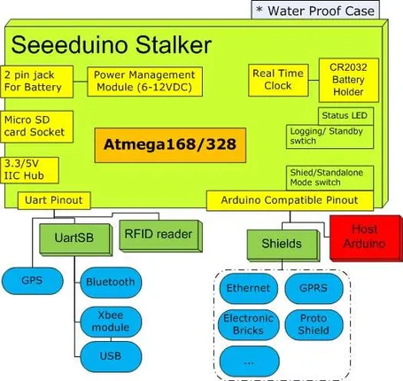
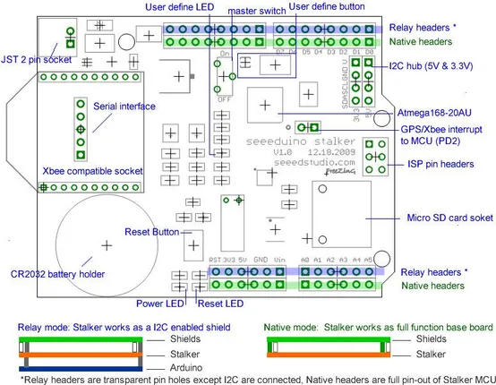

# Seeeduino Stalker V1.0

**Seeed Studio** · Source collection

Revision: Unverified source identity  
Coverage: Source collection; review pending

[Browse all manufacturers](../../../../BROWSE.md) · [Desktop app](https://github.com/valleytechsolutions/black-wire-desktop)

## Block Diagram

**source reference** · Unreviewed source · JPG

[Open original reference](../../../../library/media/0abd39d0f05c63115b62f9eb46c230b46dbe751f8627bd277571bc92669a5843.jpg)

**Credit and rights:** Source rights not yet established. Source/manufacturer: Seeed Studio.

[Source 1](https://files.seeedstudio.com/wiki/Seeeduino_Stalker_v1.0/img/Stalker-V1-Block.jpg) · [Source 2](https://wiki.seeedstudio.com/Seeeduino_Stalker_v1.0/)

Original source index: Block Diagram. This file is searchable but has not been promoted to a reviewed physical board pinout.

SHA-256: `0abd39d0f05c63115b62f9eb46c230b46dbe751f8627bd277571bc92669a5843`

## Hardware Overview

**source reference** · Unreviewed source · JPG

[Open original reference](../../../../library/media/bf22f1ebda7b07b53fb1419949094465c22786175d15946292e62dcc67175c6e.jpg)

**Credit and rights:** Source rights not yet established. Source/manufacturer: Seeed Studio.

[Source 1](https://files.seeedstudio.com/wiki/Seeeduino_Stalker_v1.0/img/Stalker-V1-hardware.jpg) · [Source 2](https://wiki.seeedstudio.com/Seeeduino_Stalker_v1.0/)

Original source index: Hardware Overview. This file is searchable but has not been promoted to a reviewed physical board pinout.

SHA-256: `bf22f1ebda7b07b53fb1419949094465c22786175d15946292e62dcc67175c6e`

Pin assignments have not been independently electrically verified. Check board revision before wiring.
