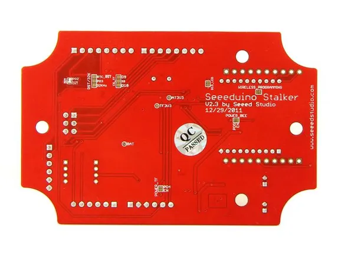
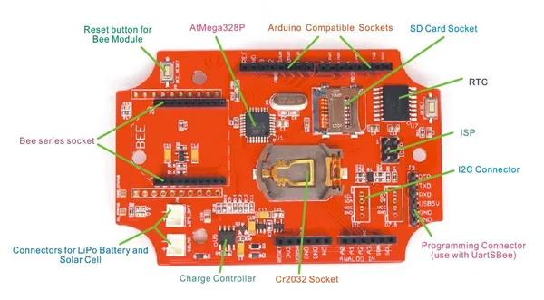

# Seeeduino Stalker V2.3

**Seeed Studio** · Source collection

Revision: Unverified source identity  
Coverage: Source collection; review pending

[Browse all manufacturers](../../../../BROWSE.md) · [Desktop app](https://github.com/valleytechsolutions/black-wire-desktop)

## Hardware Overview (Bottom)

**source reference** · Unreviewed source · JPG

[Open original reference](../../../../library/media/930909f3df10a925b28012ee17677719286185785abd2e459fa8eb054a30cce8.jpg)

**Credit and rights:** Source rights not yet established. Source/manufacturer: Seeed Studio.

[Source 1](https://files.seeedstudio.com/wiki/Seeeduino_Stalker_v2.3/img/Stalker_v2.3_bottom.jpg) · [Source 2](https://wiki.seeedstudio.com/Seeeduino_Stalker_v2.3/)

Original source index: Hardware Overview (Bottom). This file is searchable but has not been promoted to a reviewed physical board pinout.

SHA-256: `930909f3df10a925b28012ee17677719286185785abd2e459fa8eb054a30cce8`

## Hardware Overview

**source reference** · Unreviewed source · JPG

[Open original reference](../../../../library/media/c43f97caabf2b0ef081e2200b5c74f7dbfd4cf37232a569930512992b37b28aa.jpg)

**Credit and rights:** Source rights not yet established. Source/manufacturer: Seeed Studio.

[Source 1](https://files.seeedstudio.com/wiki/Seeeduino_Stalker_v2.3/img/Stalker_v2.2_diagram.jpg) · [Source 2](https://wiki.seeedstudio.com/Seeeduino_Stalker_v2.3/)

Original source index: Hardware Overview. This file is searchable but has not been promoted to a reviewed physical board pinout.

SHA-256: `c43f97caabf2b0ef081e2200b5c74f7dbfd4cf37232a569930512992b37b28aa`

Pin assignments have not been independently electrically verified. Check board revision before wiring.
