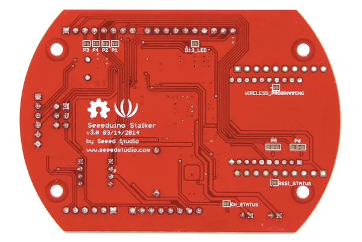
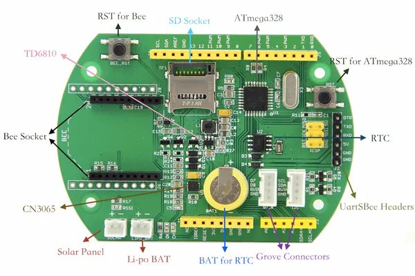

# Seeeduino Stalker V3

**Seeed Studio** · Source collection

Revision: Unverified source identity  
Coverage: Source collection; review pending

[Browse all manufacturers](../../../../BROWSE.md) · [Desktop app](https://github.com/valleytechsolutions/black-wire-desktop)

## Hardware Overview (Bottom)

**source reference** · Unreviewed source · PNG

[Open original reference](../../../../library/media/2d366d9082b95a6d8609757d5eac09b65cf5b8bda2f6b6c1343b1daacbec110e.png)

**Credit and rights:** Source rights not yet established. Source/manufacturer: Seeed Studio.

[Source 1](https://files.seeedstudio.com/wiki/Seeeduino-Stalker_v3/img/Seeed_Stalker_v3-7.png) · [Source 2](https://wiki.seeedstudio.com/Seeeduino-Stalker_v3/)

Original source index: Hardware Overview (Bottom). This file is searchable but has not been promoted to a reviewed physical board pinout.

SHA-256: `2d366d9082b95a6d8609757d5eac09b65cf5b8bda2f6b6c1343b1daacbec110e`

## Hardware Overview

**source reference** · Unreviewed source · PNG

[Open original reference](../../../../library/media/f4d42becfe847aa66ccc7e52569123cc679df8bae488a23d7e8522360bf764f5.png)

**Credit and rights:** Source rights not yet established. Source/manufacturer: Seeed Studio.

[Source 1](https://files.seeedstudio.com/wiki/Seeeduino-Stalker_v3/img/Seeed_Stalker_v3.png) · [Source 2](https://wiki.seeedstudio.com/Seeeduino-Stalker_v3/)

Original source index: Hardware Overview. This file is searchable but has not been promoted to a reviewed physical board pinout.

SHA-256: `f4d42becfe847aa66ccc7e52569123cc679df8bae488a23d7e8522360bf764f5`

Pin assignments have not been independently electrically verified. Check board revision before wiring.
