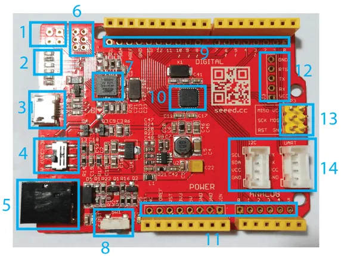

# Seeeduino V4.0

**Seeed Studio** · Source collection

Revision: Unverified source identity  
Coverage: Source collection; review pending

[Browse all manufacturers](../../../../BROWSE.md) · [Desktop app](https://github.com/valleytechsolutions/black-wire-desktop)

## Hardware Overview

**source reference** · Unreviewed source · PNG

[Open original reference](../../../../library/media/1aec8cd23ab62dd111c8f33929439e2b83814f68bd967c0ace9267e9cb2e3572.png)

**Credit and rights:** Source rights not yet established. Source/manufacturer: Seeed Studio.

[Source 1](https://files.seeedstudio.com/wiki/Seeeduino_v4.0/img/Seeeduino_v4_0_board_sections.png) · [Source 2](https://wiki.seeedstudio.com/Seeeduino_v4.0/)

Original source index: Hardware Overview. This file is searchable but has not been promoted to a reviewed physical board pinout.

SHA-256: `1aec8cd23ab62dd111c8f33929439e2b83814f68bd967c0ace9267e9cb2e3572`

Pin assignments have not been independently electrically verified. Check board revision before wiring.
