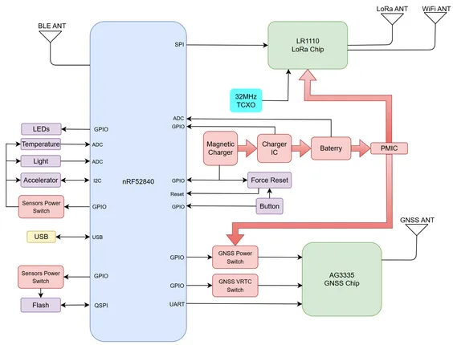
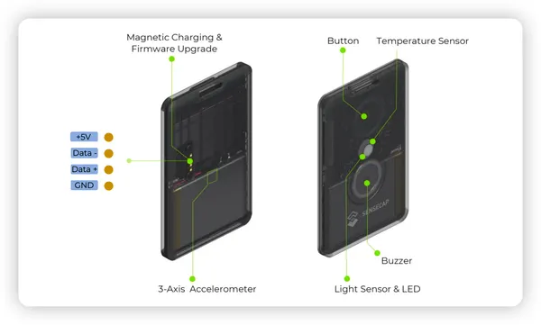
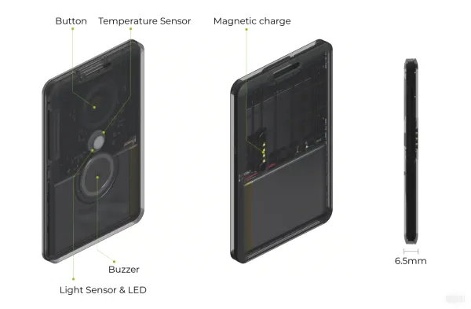

# SenseCAP Card Tracker T1000-E

**Seeed Studio** · Source collection

Revision: Unverified source identity  
Coverage: Source collection; review pending

[Browse all manufacturers](../../../../BROWSE.md) · [Devices & IoT](../../../../DEVICES.md) · [Open in the browser guide](https://valleytech-black-wire-guide.pages.dev/?board=source-board-93e8ed5cc8e7d6d1af)

Device category: **Radios & GNSS**

## Block Diagram

**source reference** · Unreviewed source · PNG

[Open original reference](../../../../library/media/292ff43295b3af4c35da7ba8b883fedfc25e37184ebb29831fdebd20a8f3751b.png)

**Credit and rights:** Source rights not yet established. Source/manufacturer: Seeed Studio.

[Source 1](https://files.seeedstudio.com/wiki/SenseCAP/LoraWAN_Tracker/diagram.png) · [Source 2](https://wiki.seeedstudio.com/get_started_with_lorawan_tracker/)

Original source index: Block Diagram. This file is searchable but has not been promoted to a reviewed physical board pinout.

Image revision: Not identified

SHA-256: `292ff43295b3af4c35da7ba8b883fedfc25e37184ebb29831fdebd20a8f3751b`

## Hardware Overview (Inside)

**source reference** · Unreviewed source · PNG

[Open original reference](../../../../library/media/ae24f8de792ac735658d40a0ce8156e580277a73099929d8109a5bd1d08c7ef4.png)

**Credit and rights:** Source rights not yet established. Source/manufacturer: Seeed Studio.

[Source 1](https://files.seeedstudio.com/wiki/SenseCAP/Meshtastic/4-pogo.png) · [Source 2](https://wiki.seeedstudio.com/t1000_e_intro/)

Original source index: Hardware Overview (Inside). This file is searchable but has not been promoted to a reviewed physical board pinout.

Image revision: Not identified

SHA-256: `ae24f8de792ac735658d40a0ce8156e580277a73099929d8109a5bd1d08c7ef4`

## Hardware Overview (Inside)

**source reference** · Unreviewed source · WEBP

[Open original reference](../../../../library/media/1ef41170069ea1ec59c2d971f3fb429d94bd898ad150c2c7674ee01b52b9daa6.webp)

**Credit and rights:** Source rights not yet established. Source/manufacturer: Seeed Studio.

[Source 1](https://files.seeedstudio.com/wiki/SenseCAP/Tracker/t1000e_for_lorawan_hardware_overview.webp) · [Source 2](https://wiki.seeedstudio.com/t1000e_for_lorawan_introduction/)

Original source index: Hardware Overview (Inside). This file is searchable but has not been promoted to a reviewed physical board pinout.

Image revision: Not identified

SHA-256: `1ef41170069ea1ec59c2d971f3fb429d94bd898ad150c2c7674ee01b52b9daa6`

Pin assignments have not been independently electrically verified. Check board revision before wiring.
