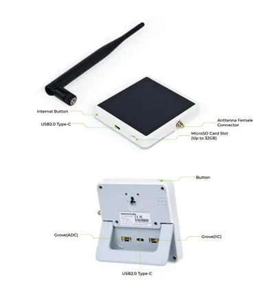

# SenseCAP Indicator for Meshtastic

**Seeed Studio** · Source collection

Revision: Unverified source identity  
Coverage: Source collection; review pending

[Browse all manufacturers](../../../../BROWSE.md) · [Devices & IoT](../../../../DEVICES.md) · [Open in the browser guide](https://valleytech-black-wire-guide.pages.dev/?board=source-board-1c8333bd42896ca6b7)

Device category: **Radios & GNSS**

## Hardware Overview

**source reference** · Unreviewed source · JPG

[Open original reference](../../../../library/media/a3d080904df0635f8823f2b2c8cda52adf3e9f92645388a75937846064cf2993.jpg)

**Credit and rights:** Source rights not yet established. Source/manufacturer: Seeed Studio.

[Source 1](https://media-cdn.seeedstudio.com/media/wysiwyg/HO-114993532.png) · [Source 2](https://wiki.seeedstudio.com/sensecap_indicator_meshtastic/)

Original source index: Hardware Overview. This file is searchable but has not been promoted to a reviewed physical board pinout.

Image revision: Not identified

SHA-256: `a3d080904df0635f8823f2b2c8cda52adf3e9f92645388a75937846064cf2993`

Pin assignments have not been independently electrically verified. Check board revision before wiring.
