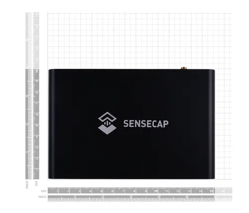
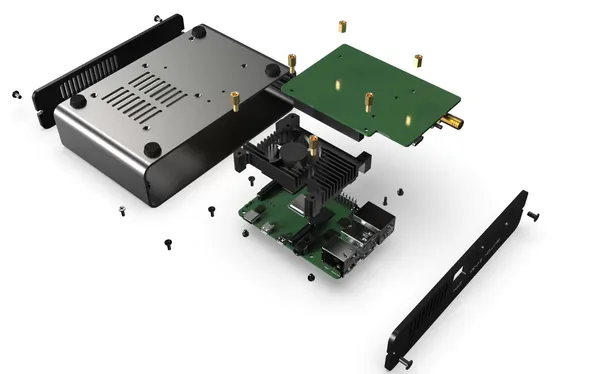
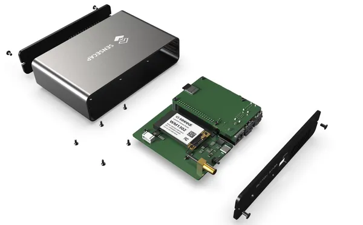
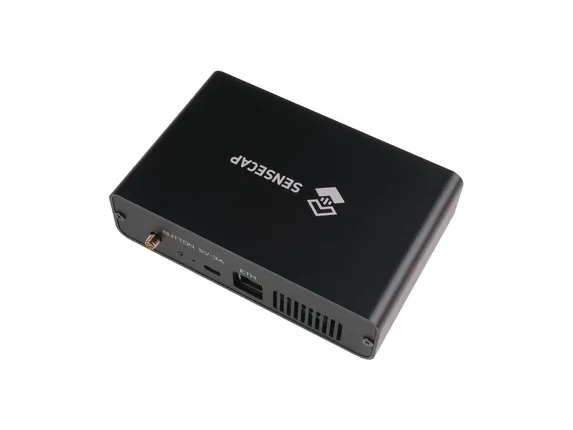

# SenseCAP M1 LoRaWAN Indoor Gateway

**Seeed Studio** · Source collection

Revision: Unverified source identity  
Coverage: Source collection; review pending

[Browse all manufacturers](../../../../BROWSE.md) · [Desktop app](https://github.com/valleytechsolutions/black-wire-desktop)

## Dimensions

**source reference** · Unreviewed source · PNG

[Open original reference](../../../../library/media/ab99f5b92aafc4a5c8182b5228e87f212927bd3362f1b8ad42bb8b0c966b9009.png)

**Credit and rights:** Source rights not yet established. Source/manufacturer: Seeed Studio.

[Source 1](https://media-cdn.seeedstudio.com/media/catalog/product/1/1/110991587_size-08_logo_8.png) · [Source 2](https://www.seeedstudio.com/SenseCAP-M1-LoRaWAN-Indoor-Gateway-US915-p-5023.html)

Original source index: Dimensions. This file is searchable but has not been promoted to a reviewed physical board pinout.

SHA-256: `ab99f5b92aafc4a5c8182b5228e87f212927bd3362f1b8ad42bb8b0c966b9009`

## Hardware Overview (Inside) 2

**source reference** · Unreviewed source · PNG

[Open original reference](../../../../library/media/78e4299ad16ffedc8a80bd5e12bd1f6d2a894b309dbe056f682609afe7d48180.png)

**Credit and rights:** Source rights not yet established. Source/manufacturer: Seeed Studio.

[Source 1](https://files.seeedstudio.com/products/110991584/%E5%BE%AE%E4%BF%A1%E5%9B%BE%E7%89%87_20210625144821.png) · [Source 2](https://www.seeedstudio.com/SenseCAP-M1-LoRaWAN-Indoor-Gateway-US915-p-5023.html)

Original source index: Hardware Overview (Inside) 2. This file is searchable but has not been promoted to a reviewed physical board pinout.

SHA-256: `78e4299ad16ffedc8a80bd5e12bd1f6d2a894b309dbe056f682609afe7d48180`

## Hardware Overview (Inside)

**source reference** · Unreviewed source · PNG

[Open original reference](../../../../library/media/411361197ffba3f87fac367f9ea3ca91bcb257cec1fb516bbffb69048ff58ed9.png)

**Credit and rights:** Source rights not yet established. Source/manufacturer: Seeed Studio.

[Source 1](https://files.seeedstudio.com/products/110991584/%E5%BE%AE%E4%BF%A1%E5%9B%BE%E7%89%87_20210625144809.png) · [Source 2](https://www.seeedstudio.com/SenseCAP-M1-LoRaWAN-Indoor-Gateway-US915-p-5023.html)

Original source index: Hardware Overview (Inside). This file is searchable but has not been promoted to a reviewed physical board pinout.

SHA-256: `411361197ffba3f87fac367f9ea3ca91bcb257cec1fb516bbffb69048ff58ed9`

## Hardware Overview (Ports)

**source reference** · Unreviewed source · PNG

[Open original reference](../../../../library/media/65ec3be9b97ecb96ed3a36c89750df8abdaebb7ec87b04b244053c655b9a8874.png)

**Credit and rights:** Source rights not yet established. Source/manufacturer: Seeed Studio.

[Source 1](https://media-cdn.seeedstudio.com/media/catalog/product/1/1/110991584_preview-16_8.png) · [Source 2](https://www.seeedstudio.com/SenseCAP-M1-LoRaWAN-Indoor-Gateway-US915-p-5023.html)

Original source index: Hardware Overview (Ports). This file is searchable but has not been promoted to a reviewed physical board pinout.

SHA-256: `65ec3be9b97ecb96ed3a36c89750df8abdaebb7ec87b04b244053c655b9a8874`

Pin assignments have not been independently electrically verified. Check board revision before wiring.
