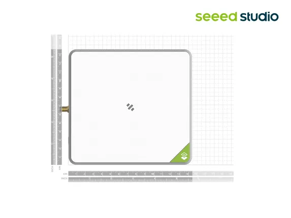
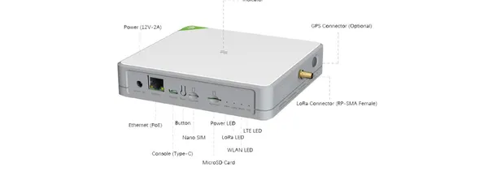

# SenseCAP M2 Multi-Platform Gateway

**Seeed Studio** · Source collection

Revision: Unverified source identity  
Coverage: Source collection; review pending

[Browse all manufacturers](../../../../BROWSE.md) · [Devices & IoT](../../../../DEVICES.md) · [Open in the browser guide](https://valleytech-black-wire-guide.pages.dev/?board=source-board-83c49520a589e74cfa)

Device category: **Controllers & instruments**

## Dimensions

**source reference** · Unreviewed source · JPG

[Open original reference](../../../../library/media/09a05e23ec44aaade0862577ff561d1a25c9c50f3f7bc5a8a0b9e612a14e0367.jpg)

**Credit and rights:** Source rights not yet established. Source/manufacturer: Seeed Studio.

[Source 1](https://media-cdn.seeedstudio.com/media/catalog/product/1/1/114992981_size.jpg) · [Source 2](https://www.seeedstudio.com/SenseCAP-Multi-Platform-LoRaWAN-Indoor-Gateway-SX1302-EU868-p-5471.html)

Original source index: Dimensions. This file is searchable but has not been promoted to a reviewed physical board pinout.

Image revision: Not identified

SHA-256: `09a05e23ec44aaade0862577ff561d1a25c9c50f3f7bc5a8a0b9e612a14e0367`

## Interfaces

**source reference** · Unreviewed source · PNG

[Open original reference](../../../../library/media/3aea6c836ce8f1ad23b6dcab80f38bb9c2415cf2d19a353eea208a3a2a6d3c99.png)

**Credit and rights:** Source rights not yet established. Source/manufacturer: Seeed Studio.

[Source 1](https://files.seeedstudio.com/products/SenseCAP%20M2/Quick%20Start%20for%20SenseCAP%20M2%20Multi-Platfrom%20Gateway%20&%20Sensors.pdf) · [Source 2](https://wiki.seeedstudio.com/Network/SenseCAP_Network/SenseCAP_M2_Multi_Platform/SenseCAP_M2_Multi_Platform_Overview/ (linked Quick Start PDF, page 7 'Connect with Cellular'))

Original source index: Interfaces. This file is searchable but has not been promoted to a reviewed physical board pinout.

Image revision: Not identified

SHA-256: `3aea6c836ce8f1ad23b6dcab80f38bb9c2415cf2d19a353eea208a3a2a6d3c99`

Pin assignments have not been independently electrically verified. Check board revision before wiring.
