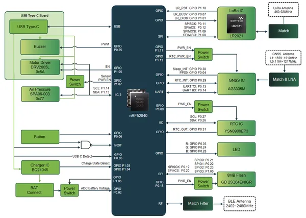
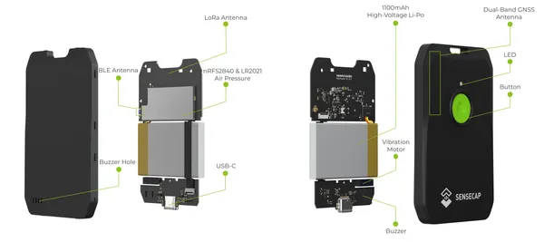

# SenseCAP MeshTracker X1

**Seeed Studio** · Source collection

Revision: Unverified source identity  
Coverage: Source collection; review pending

[Browse all manufacturers](../../../../BROWSE.md) · [Devices & IoT](../../../../DEVICES.md) · [Open in the browser guide](https://valleytech-black-wire-guide.pages.dev/?board=source-board-ea973389e5013fc905)

Device category: **Radios & GNSS**

## Block Diagram

**source reference** · Unreviewed source · PNG

[Open original reference](../../../../library/media/5e85fcaf87b275241815db8a214329ff75f0585c48536e67c8af334bc30a3190.png)

**Credit and rights:** Source rights not yet established. Source/manufacturer: Seeed Studio.

[Source 1](https://files.seeedstudio.com/wiki/SenseCAP/MeshTrackerX1/HardwareDiagram729.png) · [Source 2](https://wiki.seeedstudio.com/meshtracker_x1_intro/)

Original source index: Block Diagram. This file is searchable but has not been promoted to a reviewed physical board pinout.

Image revision: Not identified

SHA-256: `5e85fcaf87b275241815db8a214329ff75f0585c48536e67c8af334bc30a3190`

## Hardware Overview

**source reference** · Unreviewed source · PNG

[Open original reference](../../../../library/media/a3734647af1a4f2c559abac1c58e877c8978c75b405be597fdf3916bf6c316f5.png)

**Credit and rights:** Source rights not yet established. Source/manufacturer: Seeed Studio.

[Source 1](https://files.seeedstudio.com/wiki/SenseCAP/MeshTrackerX1/HardwareDiagramBu.png) · [Source 2](https://wiki.seeedstudio.com/meshtracker_x1_intro/)

Original source index: Hardware Overview. This file is searchable but has not been promoted to a reviewed physical board pinout.

Image revision: Not identified

SHA-256: `a3734647af1a4f2c559abac1c58e877c8978c75b405be597fdf3916bf6c316f5`

Pin assignments have not been independently electrically verified. Check board revision before wiring.
