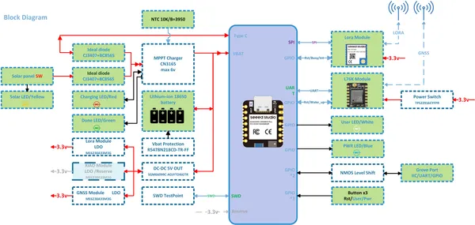
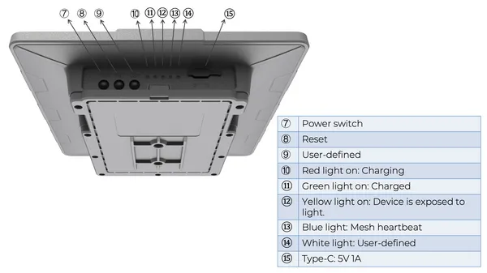

# SenseCAP Solar Node P1

**Seeed Studio** · Source collection

Revision: Unverified source identity  
Coverage: Source collection; review pending

[Browse all manufacturers](../../../../BROWSE.md) · [Devices & IoT](../../../../DEVICES.md) · [Open in the browser guide](https://valleytech-black-wire-guide.pages.dev/?board=source-board-543509c5ebc201f64b)

Device category: **Radios & GNSS**

## Block Diagram

**source reference** · Unreviewed source · PNG

[Open original reference](../../../../library/media/a4878c0a8ed6228b0ffa580d3d1bbe2bcc9b4a371605220ea6aac72991bc4b81.png)

**Credit and rights:** Source rights not yet established. Source/manufacturer: Seeed Studio.

[Source 1](https://files.seeedstudio.com/wiki/SenseCAP/Meshtastic/solar_node_diagram.png) · [Source 2](https://wiki.seeedstudio.com/meshtastic_solar_node/)

Original source index: Block Diagram. This file is searchable but has not been promoted to a reviewed physical board pinout.

Image revision: Not identified

SHA-256: `a4878c0a8ed6228b0ffa580d3d1bbe2bcc9b4a371605220ea6aac72991bc4b81`

## Hardware Overview (Back)

**source reference** · Unreviewed source · PNG

[Open original reference](../../../../library/media/f7a0d22683b6c882bc64cf9816f5998a1c6980b9c8411e67e4daf18ba2c95056.png)

**Credit and rights:** Source rights not yet established. Source/manufacturer: Seeed Studio.

[Source 1](https://files.seeedstudio.com/wiki/SenseCAP/Meshtastic/interactive.png) · [Source 2](https://wiki.seeedstudio.com/meshtastic_solar_node/)

Original source index: Hardware Overview (Back). This file is searchable but has not been promoted to a reviewed physical board pinout.

Image revision: Not identified

SHA-256: `f7a0d22683b6c882bc64cf9816f5998a1c6980b9c8411e67e4daf18ba2c95056`

Pin assignments have not been independently electrically verified. Check board revision before wiring.
