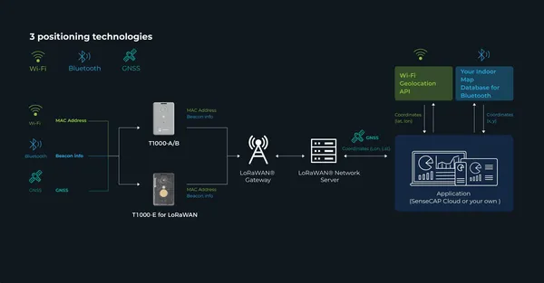
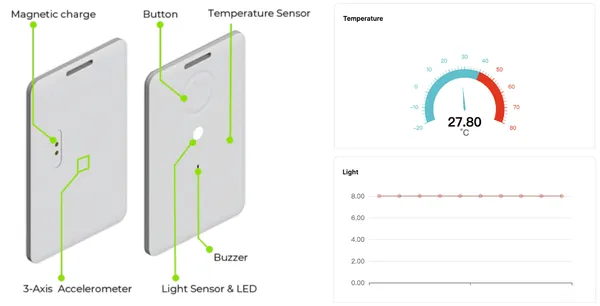

# SenseCAP T1000 Tracker

**Seeed Studio** · Source collection

Revision: Unverified source identity  
Coverage: Source collection; review pending

[Browse all manufacturers](../../../../BROWSE.md) · [Devices & IoT](../../../../DEVICES.md) · [Open in the browser guide](https://valleytech-black-wire-guide.pages.dev/?board=source-board-50c907769be71a034c)

Device category: **Radios & GNSS**

## Block Diagram

**source reference** · Unreviewed source · PNG

[Open original reference](../../../../library/media/4973f6ce07d10fb164db6b218db0e93159ed92817644a52e8f5eee97c2dddb0b.png)

**Credit and rights:** Source rights not yet established. Source/manufacturer: Seeed Studio.

[Source 1](https://files.seeedstudio.com/wiki/SenseCAP/Tracker/framework_new.png) · [Source 2](https://wiki.seeedstudio.com/SenseCAP_T1000_tracker/Introduction/)

Original source index: Block Diagram. This file is searchable but has not been promoted to a reviewed physical board pinout.

Image revision: Not identified

SHA-256: `4973f6ce07d10fb164db6b218db0e93159ed92817644a52e8f5eee97c2dddb0b`

## Hardware Overview

**source reference** · Unreviewed source · PNG

[Open original reference](../../../../library/media/628842ad09edda0a1bb2a17f03cea9b331eb10356382584c07a99fd63c715d26.png)

**Credit and rights:** Source rights not yet established. Source/manufacturer: Seeed Studio.

[Source 1](https://files.seeedstudio.com/wiki/SenseCAP/Tracker/sensor.png) · [Source 2](https://wiki.seeedstudio.com/SenseCAP_T1000_tracker/Introduction/)

Original source index: Hardware Overview. This file is searchable but has not been promoted to a reviewed physical board pinout.

Image revision: Not identified

SHA-256: `628842ad09edda0a1bb2a17f03cea9b331eb10356382584c07a99fd63c715d26`

Pin assignments have not been independently electrically verified. Check board revision before wiring.
