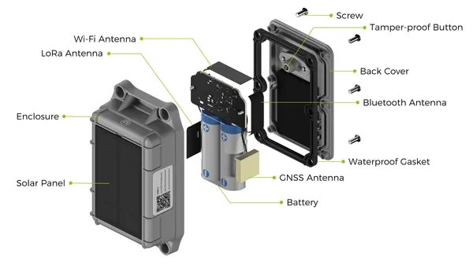
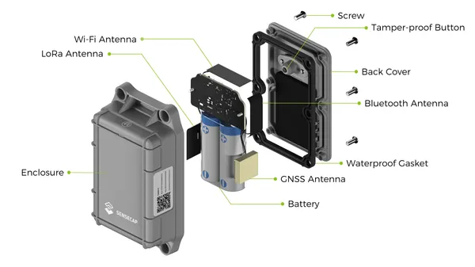
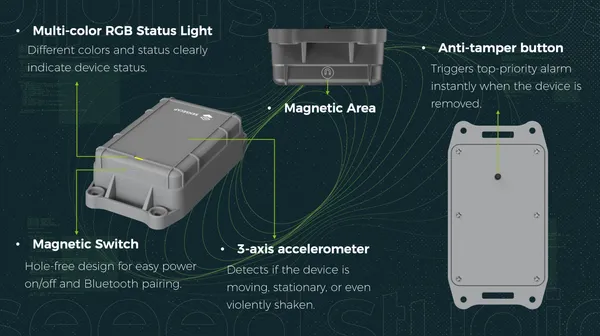

# SenseCAP T2000 Tracker

**Seeed Studio** · Source collection

Revision: Unverified source identity  
Coverage: Source collection; review pending

[Browse all manufacturers](../../../../BROWSE.md) · [Desktop app](https://github.com/valleytechsolutions/black-wire-desktop)

## Hardware Overview (Inside) 2

**source reference** · Unreviewed source · PNG

[Open original reference](../../../../library/media/37fcc970f79d26aa30307539018b592f03497a09ce172fc120100d15eec94a9f.png)

**Credit and rights:** Source rights not yet established. Source/manufacturer: Seeed Studio.

[Source 1](https://files.seeedstudio.com/wiki/SenseCAP/SenseCAP_T2000_Tracker/SenseCAP_T2000C_Tracker_Hardware.jpg) · [Source 2](https://wiki.seeedstudio.com/Get_Started_with_SenseCAP_T2000_tracker/)

Original source index: Hardware Overview (Inside) 2. This file is searchable but has not been promoted to a reviewed physical board pinout.

SHA-256: `37fcc970f79d26aa30307539018b592f03497a09ce172fc120100d15eec94a9f`

## Hardware Overview (Inside)

**source reference** · Unreviewed source · PNG

[Open original reference](../../../../library/media/887a35fbfb50399034b460c019c88155d7503ca44355593d401f0c8896d6dfcf.png)

**Credit and rights:** Source rights not yet established. Source/manufacturer: Seeed Studio.

[Source 1](https://files.seeedstudio.com/wiki/SenseCAP/SenseCAP_T2000_Tracker/SenseCAP_T2000AB_Tracker_Hardware.jpg) · [Source 2](https://wiki.seeedstudio.com/Get_Started_with_SenseCAP_T2000_tracker/)

Original source index: Hardware Overview (Inside). This file is searchable but has not been promoted to a reviewed physical board pinout.

SHA-256: `887a35fbfb50399034b460c019c88155d7503ca44355593d401f0c8896d6dfcf`

## Hardware Overview

**source reference** · Unreviewed source · PNG

[Open original reference](../../../../library/media/6f97d95d7c0bc500f44a3653ee27b5f50977b25853dfdb16090d066ae68644d7.png)

**Credit and rights:** Source rights not yet established. Source/manufacturer: Seeed Studio.

[Source 1](https://files.seeedstudio.com/wiki/SenseCAP/SenseCAP_T2000_Tracker/SenseCAP_T2000_Tracker_Hardware_Overview.png) · [Source 2](https://wiki.seeedstudio.com/Get_Started_with_SenseCAP_T2000_tracker/)

Original source index: Hardware Overview. This file is searchable but has not been promoted to a reviewed physical board pinout.

SHA-256: `6f97d95d7c0bc500f44a3653ee27b5f50977b25853dfdb16090d066ae68644d7`

Pin assignments have not been independently electrically verified. Check board revision before wiring.
