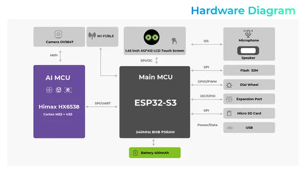
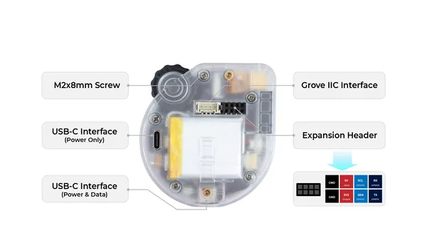
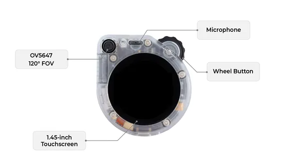
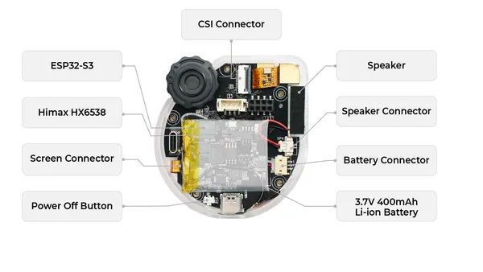
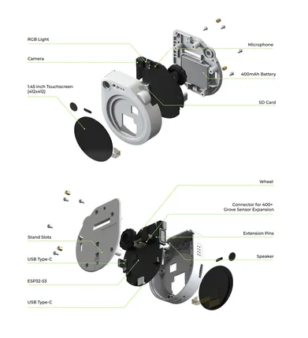

# SenseCAP Watcher

**Seeed Studio** · Source collection

Revision: Unverified source identity  
Coverage: Source collection; review pending

[Browse all manufacturers](../../../../BROWSE.md) · [Desktop app](https://github.com/valleytechsolutions/black-wire-desktop)

## Block Diagram

**source reference** · Unreviewed source · PNG

[Open original reference](../../../../library/media/8f5ca79ee55994920b7562e4a4ecdc7c8857820ceea750f22db6732fa44af64e.png)

**Credit and rights:** Source rights not yet established. Source/manufacturer: Seeed Studio.

[Source 1](https://files.seeedstudio.com/wiki/watcher_getting_started/Diagram.png) · [Source 2](https://wiki.seeedstudio.com/watcher_hardware_overview/)

Original source index: Block Diagram. This file is searchable but has not been promoted to a reviewed physical board pinout.

SHA-256: `8f5ca79ee55994920b7562e4a4ecdc7c8857820ceea750f22db6732fa44af64e`

## Hardware Overview (Back)

**source reference** · Unreviewed source · PNG

[Open original reference](../../../../library/media/fcf19e2fb0203b2f5b2d4a5bbcad2f6031ecafb7104fefac75658c8a347fd17b.png)

**Credit and rights:** Source rights not yet established. Source/manufacturer: Seeed Studio.

[Source 1](https://files.seeedstudio.com/wiki/watcher_getting_started/hardware-2.png) · [Source 2](https://wiki.seeedstudio.com/watcher_hardware_overview/)

Original source index: Hardware Overview (Back). This file is searchable but has not been promoted to a reviewed physical board pinout.

SHA-256: `fcf19e2fb0203b2f5b2d4a5bbcad2f6031ecafb7104fefac75658c8a347fd17b`

## Hardware Overview (Front)

**source reference** · Unreviewed source · PNG

[Open original reference](../../../../library/media/500a680b81ca1c53d4d71d49c34b38161ff2e21f3b1eacc1c45d440574cf6642.png)

**Credit and rights:** Source rights not yet established. Source/manufacturer: Seeed Studio.

[Source 1](https://files.seeedstudio.com/wiki/watcher_getting_started/hardware-1.png) · [Source 2](https://wiki.seeedstudio.com/watcher_hardware_overview/)

Original source index: Hardware Overview (Front). This file is searchable but has not been promoted to a reviewed physical board pinout.

SHA-256: `500a680b81ca1c53d4d71d49c34b38161ff2e21f3b1eacc1c45d440574cf6642`

## Hardware Overview (Inside)

**source reference** · Unreviewed source · PNG

[Open original reference](../../../../library/media/a8b67a5a2f56a2303050260c82c78d650c678263eb2b53139301a8eb842670ef.png)

**Credit and rights:** Source rights not yet established. Source/manufacturer: Seeed Studio.

[Source 1](https://files.seeedstudio.com/wiki/watcher_getting_started/hardware-3.png) · [Source 2](https://wiki.seeedstudio.com/watcher_hardware_overview/)

Original source index: Hardware Overview (Inside). This file is searchable but has not been promoted to a reviewed physical board pinout.

SHA-256: `a8b67a5a2f56a2303050260c82c78d650c678263eb2b53139301a8eb842670ef`

## Hardware Overview

**source reference** · Unreviewed source · JPG

[Open original reference](../../../../library/media/64e4244bbd9b71a91b423d84b5217801d8b51dde53ca8021f54ed63f60f82669.jpg)

**Credit and rights:** Source rights not yet established. Source/manufacturer: Seeed Studio.

[Source 1](https://files.seeedstudio.com/wiki/watcher_getting_started/hardware_overview.jpg) · [Source 2](https://wiki.seeedstudio.com/watcher_hardware_overview/)

Original source index: Hardware Overview. This file is searchable but has not been promoted to a reviewed physical board pinout.

SHA-256: `64e4244bbd9b71a91b423d84b5217801d8b51dde53ca8021f54ed63f60f82669`

Pin assignments have not been independently electrically verified. Check board revision before wiring.
