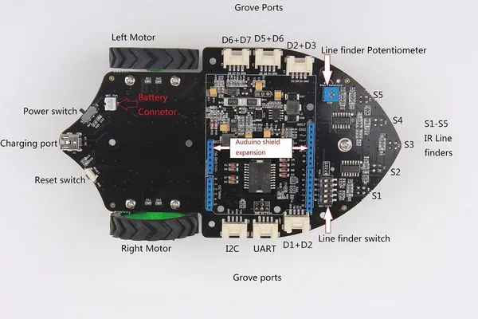

# Shield Bot V1.1

**Seeed Studio** · Source collection

Revision: Unverified source identity  
Coverage: Source collection; review pending

[Browse all manufacturers](../../../../BROWSE.md) · [Desktop app](https://github.com/valleytechsolutions/black-wire-desktop)

## Hardware Overview

**source reference** · Unreviewed source · JPG

[Open original reference](../../../../library/media/85a2681f17fcd253f49477bbecb675e71c4e9c6fa9444e8f7ff49b1991048ee1.jpg)

**Credit and rights:** Source rights not yet established. Source/manufacturer: Seeed Studio.

[Source 1](https://files.seeedstudio.com/wiki/Shield_Bot_V1.1/img/Shield_Bot_V1.2_Foto_1.JPG) · [Source 2](https://wiki.seeedstudio.com/Shield_Bot_V1.1/)

Original source index: Hardware Overview. This file is searchable but has not been promoted to a reviewed physical board pinout.

SHA-256: `85a2681f17fcd253f49477bbecb675e71c4e9c6fa9444e8f7ff49b1991048ee1`

Pin assignments have not been independently electrically verified. Check board revision before wiring.
