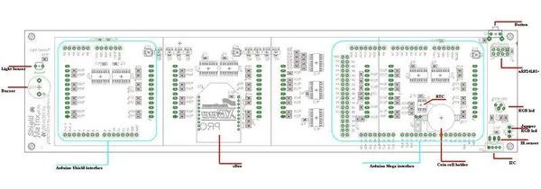

# Shield MaTrix V0.9

**Seeed Studio** · Source collection

Revision: Unverified source identity  
Coverage: Source collection; review pending

[Browse all manufacturers](../../../../BROWSE.md) · [Desktop app](https://github.com/valleytechsolutions/black-wire-desktop)

## Hardware Overview (Front)

**source reference** · Unreviewed source · JPG

[Open original reference](../../../../library/media/88ca995b870e92e4128f3d2a3ea5e4b745aa138e7bef4c6f47baf303669a6c6b.jpg)

**Credit and rights:** Source rights not yet established. Source/manufacturer: Seeed Studio.

[Source 1](https://files.seeedstudio.com/wiki/Shield-MaTrix-V0.9b/img/MFull.JPG) · [Source 2](https://wiki.seeedstudio.com/Shield-MaTrix-V0.9b/)

Original source index: Hardware Overview (Front). This file is searchable but has not been promoted to a reviewed physical board pinout.

SHA-256: `88ca995b870e92e4128f3d2a3ea5e4b745aa138e7bef4c6f47baf303669a6c6b`

Pin assignments have not been independently electrically verified. Check board revision before wiring.
