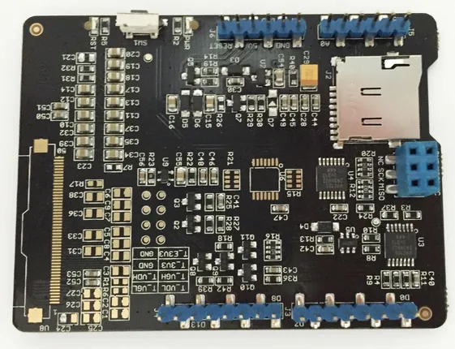

# Small e-Paper Shield V2

**Seeed Studio** · Source collection

Revision: Unverified source identity  
Coverage: Source collection; review pending

[Browse all manufacturers](../../../../BROWSE.md) · [Desktop app](https://github.com/valleytechsolutions/black-wire-desktop)

## Hardware Overview (Back)

**source reference** · Unreviewed source · JPG

[Open original reference](../../../../library/media/58b9c6771ebe1d485e6f2ccf24e7aafb60b537abf186c2378a8d4c80c09aafc3.jpg)

**Credit and rights:** Source rights not yet established. Source/manufacturer: Seeed Studio.

[Source 1](https://files.seeedstudio.com/wiki/Small_e-Paper_Shield_V2/img/Small_e-Paper_shield_b.jpg) · [Source 2](https://wiki.seeedstudio.com/Small_e-Paper_Shield_V2/)

Original source index: Hardware Overview (Back). This file is searchable but has not been promoted to a reviewed physical board pinout.

SHA-256: `58b9c6771ebe1d485e6f2ccf24e7aafb60b537abf186c2378a8d4c80c09aafc3`

Pin assignments have not been independently electrically verified. Check board revision before wiring.
