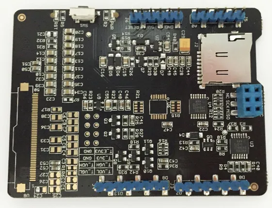

# Small e-Paper Shield V2

**Seeed Studio** · Source collection

Revision: Unverified source identity

Coverage: Source collection; review pending

[Browse all manufacturers](../../../../BROWSE.md) · [Devices & IoT](../../../../DEVICES.md) · [Open in the browser guide](https://valleytech-black-wire-guide.pages.dev/?board=source-board-f85cd857916a872a69)

## Datasheets and original documentation

Board datasheet: **not yet recorded**. Visual reference: **available**.

[Manufacturer source (recorded link)](https://wiki.seeedstudio.com/Small_e-Paper_Shield_V2/)

A chip datasheet, schematic and board datasheet have different scopes. Match the exact hardware revision.

[Documentation coverage and remaining gaps](../../../../DOCUMENTATION.md)

## Hardware Overview (Back)

**source reference** · Unreviewed source · JPG

[Open original reference](../../../../library/media/58b9c6771ebe1d485e6f2ccf24e7aafb60b537abf186c2378a8d4c80c09aafc3.jpg)

**Credit and rights:** Source rights not yet established. Source/manufacturer: Seeed Studio.

[Source 1](https://files.seeedstudio.com/wiki/Small_e-Paper_Shield_V2/img/Small_e-Paper_shield_b.jpg) · [Source 2](https://wiki.seeedstudio.com/Small_e-Paper_Shield_V2/)

Original source index: Hardware Overview (Back). This file is searchable but has not been promoted to a reviewed physical board pinout.

Image revision: Not identified

SHA-256: `58b9c6771ebe1d485e6f2ccf24e7aafb60b537abf186c2378a8d4c80c09aafc3`

Pin assignments have not been independently electrically verified. Check board revision before wiring.
