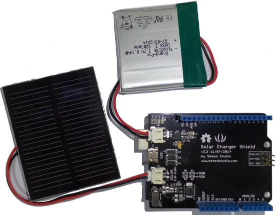
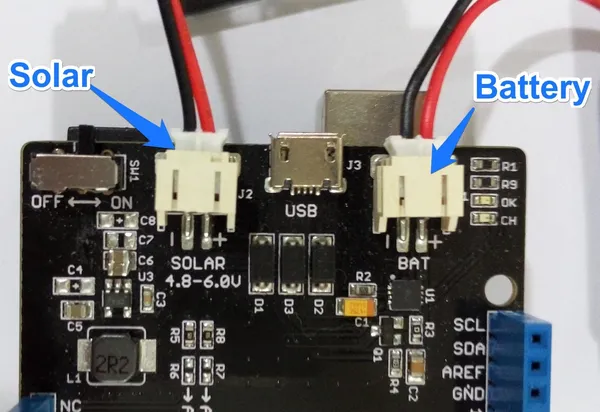
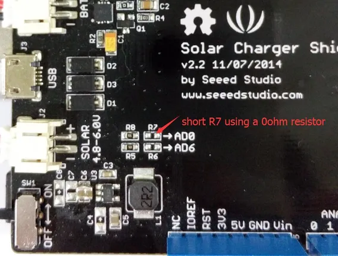

# Solar Charger Shield V2.2

**Seeed Studio** · Source collection

Revision: Unverified source identity  
Coverage: Source collection; review pending

[Browse all manufacturers](../../../../BROWSE.md) · [Desktop app](https://github.com/valleytechsolutions/black-wire-desktop)

## Hardware Overview (Front)

**source reference** · Unreviewed source · JPG

[Open original reference](../../../../library/media/fbf5642eedfed6ffec82e86c340e75786abfd70a43dc56aed059c969f01e0e65.jpg)

**Credit and rights:** Source rights not yet established. Source/manufacturer: Seeed Studio.

[Source 1](https://files.seeedstudio.com/wiki/Solar_Charger_Shield_V2.2/img/Solar_Charger_Shield_v2.2.jpg) · [Source 2](https://wiki.seeedstudio.com/Solar_Charger_Shield_V2.2/)

Original source index: Hardware Overview (Front). This file is searchable but has not been promoted to a reviewed physical board pinout.

SHA-256: `fbf5642eedfed6ffec82e86c340e75786abfd70a43dc56aed059c969f01e0e65`

## Interfaces

**source reference** · Unreviewed source · JPG

[Open original reference](../../../../library/media/bdaaeffdc45f0f5de3d5e15ec398d5c9071209d1b73d7516dcf393b0a66ffa2e.jpg)

**Credit and rights:** Source rights not yet established. Source/manufacturer: Seeed Studio.

[Source 1](https://files.seeedstudio.com/wiki/Solar_Charger_Shield_V2.2/img/Solar_Charger_Shield_v2.2_inputs.jpg) · [Source 2](https://wiki.seeedstudio.com/Solar_Charger_Shield_V2.2/)

Original source index: Interfaces. This file is searchable but has not been promoted to a reviewed physical board pinout.

SHA-256: `bdaaeffdc45f0f5de3d5e15ec398d5c9071209d1b73d7516dcf393b0a66ffa2e`

## Pin Functions

**source reference** · Unreviewed source · JPG

[Open original reference](../../../../library/media/f61d1af81cb12dab110a0ea3072baab18fe7417dbb73ea93bf00b579c9bf9be7.jpg)

**Credit and rights:** Source rights not yet established. Source/manufacturer: Seeed Studio.

[Source 1](https://files.seeedstudio.com/wiki/Solar_Charger_Shield_V2.2/img/Solar_Charger_Shield_v2.2_shortR7.jpg) · [Source 2](https://wiki.seeedstudio.com/Solar_Charger_Shield_V2.2/)

Original source index: Pin Functions. This file is searchable but has not been promoted to a reviewed physical board pinout.

SHA-256: `f61d1af81cb12dab110a0ea3072baab18fe7417dbb73ea93bf00b579c9bf9be7`

Pin assignments have not been independently electrically verified. Check board revision before wiring.
