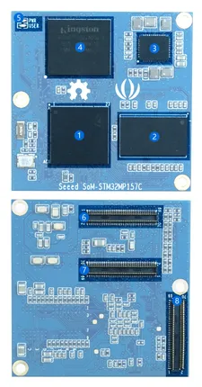

# SOM STM32MP157C

**Seeed Studio** · Source collection

Revision: Unverified source identity  
Coverage: Source collection; review pending

[Browse all manufacturers](../../../../BROWSE.md) · [Desktop app](https://github.com/valleytechsolutions/black-wire-desktop)

## Dimensions

**source reference** · Unreviewed source · PDF

[Open original reference](../../../../library/media/2250c733565c68f745e0acd7750913a579f36911ce6ed4e1e131531951df0b41.pdf)

**Credit and rights:** Source rights not yet established. Source/manufacturer: Seeed Studio.

[Source 1](https://files.seeedstudio.com/wiki/SEEED-SOM-STM32MP157C/res/Seeed_SoM-STM32MP157C_v1.0_bottom.pdf) · [Source 2](https://wiki.seeedstudio.com/SEEED-SOM-STM32MP157C/)

Original source index: Dimensions. This file is searchable but has not been promoted to a reviewed physical board pinout.

SHA-256: `2250c733565c68f745e0acd7750913a579f36911ce6ed4e1e131531951df0b41`

## Hardware Overview

**source reference** · Unreviewed source · PNG

[Open original reference](../../../../library/media/41dc5b647ab38b36dbd602e2775b03cdb0f6a6b5a39814125b0df83e59238483.png)

**Credit and rights:** Source rights not yet established. Source/manufacturer: Seeed Studio.

[Source 1](https://files.seeedstudio.com/wiki/Seeed-NPi-STM32MP157C/IMG/SOM-overview.png) · [Source 2](https://wiki.seeedstudio.com/SEEED-SOM-STM32MP157C/)

Original source index: Hardware Overview. This file is searchable but has not been promoted to a reviewed physical board pinout.

SHA-256: `41dc5b647ab38b36dbd602e2775b03cdb0f6a6b5a39814125b0df83e59238483`

Pin assignments have not been independently electrically verified. Check board revision before wiring.
