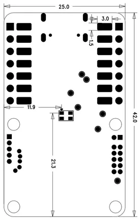
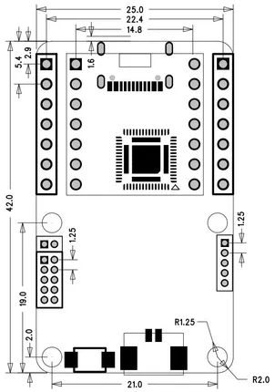

# Sound Event Detection Module

**Seeed Studio** · Source collection

Revision: Unverified source identity  
Coverage: Source collection; review pending

[Browse all manufacturers](../../../../BROWSE.md) · [Desktop app](https://github.com/valleytechsolutions/black-wire-desktop)

## Dimensions (Back)

**source reference** · Unreviewed source · PNG

[Open original reference](../../../../library/media/ee00604f7a993d784461ab8217bf8c347f4bb1459ef286e4c85b226956758501.png)

**Credit and rights:** Source rights not yet established. Source/manufacturer: Seeed Studio.

[Source 1](https://files.seeedstudio.com/wiki/sound_event_detection/back.png) · [Source 2](https://wiki.seeedstudio.com/sound_event_detection_module/)

Original source index: Dimensions (Back). This file is searchable but has not been promoted to a reviewed physical board pinout.

SHA-256: `ee00604f7a993d784461ab8217bf8c347f4bb1459ef286e4c85b226956758501`

## Dimensions (Front)

**source reference** · Unreviewed source · PNG

[Open original reference](../../../../library/media/3ee61ef60dbb4040824263683a19943d632561dd2919e87c1bf857b0954d0c2b.png)

**Credit and rights:** Source rights not yet established. Source/manufacturer: Seeed Studio.

[Source 1](https://files.seeedstudio.com/wiki/sound_event_detection/front.png) · [Source 2](https://wiki.seeedstudio.com/sound_event_detection_module/)

Original source index: Dimensions (Front). This file is searchable but has not been promoted to a reviewed physical board pinout.

SHA-256: `3ee61ef60dbb4040824263683a19943d632561dd2919e87c1bf857b0954d0c2b`

Pin assignments have not been independently electrically verified. Check board revision before wiring.
