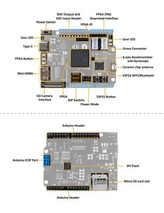

# Spartan Edge Accelerator Board

**Seeed Studio** · Source collection

Revision: Unverified source identity  
Coverage: Source collection; review pending

[Browse all manufacturers](../../../../BROWSE.md) · [Desktop app](https://github.com/valleytechsolutions/black-wire-desktop)

## Hardware Overview

**source reference** · Unreviewed source · JPG

[Open original reference](../../../../library/media/fee1a35d7dc71839136b207f6e244f4bc1060f28867459e4f0fd5c2e19e66dfd.jpg)

**Credit and rights:** Source rights not yet established. Source/manufacturer: Seeed Studio.

[Source 1](https://files.seeedstudio.com/wiki/Spartan-Edge-Accelerator-Board/img/Spartan-Edge-Accelerater-Board-v1.0-pin.jpg) · [Source 2](https://wiki.seeedstudio.com/Spartan-Edge-Accelerator-Board/)

Original source index: Hardware Overview. This file is searchable but has not been promoted to a reviewed physical board pinout.

SHA-256: `fee1a35d7dc71839136b207f6e244f4bc1060f28867459e4f0fd5c2e19e66dfd`

Pin assignments have not been independently electrically verified. Check board revision before wiring.
