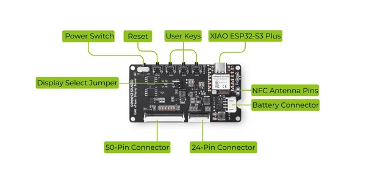

# TRMNL 7.5inch (OG) DIY Kit

**Seeed Studio** · Source collection

Revision: Unverified source identity  
Coverage: Source collection; review pending

[Browse all manufacturers](../../../../BROWSE.md) · [Desktop app](https://github.com/valleytechsolutions/black-wire-desktop)

## Hardware Overview

**source reference** · Unreviewed source · PNG

[Open original reference](../../../../library/media/40e8a9047403c53f552d722f0d4d935ea7f26b8b91c9066ba30386be4182600e.png)

**Credit and rights:** Source rights not yet established. Source/manufacturer: Seeed Studio.

[Source 1](https://files.seeedstudio.com/wiki/XIAO_Gadget/TRMNL_Kit_Pic/overview.png) · [Source 2](https://wiki.seeedstudio.com/trmnl_7inch5_diy_kit_main_page/)

Original source index: Hardware Overview. This file is searchable but has not been promoted to a reviewed physical board pinout.

SHA-256: `40e8a9047403c53f552d722f0d4d935ea7f26b8b91c9066ba30386be4182600e`

Pin assignments have not been independently electrically verified. Check board revision before wiring.
