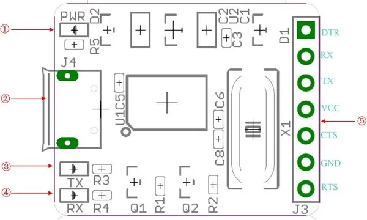

# USB To Uart 3V3

**Seeed Studio** · Source collection

Revision: Unverified source identity  
Coverage: Source collection; review pending

[Browse all manufacturers](../../../../BROWSE.md) · [Desktop app](https://github.com/valleytechsolutions/black-wire-desktop)

## Interfaces

**source reference** · Unreviewed source · JPG

[Open original reference](../../../../library/media/4152d8114134db06f12a1abf196533274b74237a150cb3f2b54c5873a4901be4.jpg)

**Credit and rights:** Source rights not yet established. Source/manufacturer: Seeed Studio.

[Source 1](https://files.seeedstudio.com/wiki/USB_To_Uart_3V3/img/USB_To_Uart_3V3_Interface.jpg) · [Source 2](https://wiki.seeedstudio.com/USB_To_Uart_3V3/)

Original source index: Interfaces. This file is searchable but has not been promoted to a reviewed physical board pinout.

SHA-256: `4152d8114134db06f12a1abf196533274b74237a150cb3f2b54c5873a4901be4`

Pin assignments have not been independently electrically verified. Check board revision before wiring.
