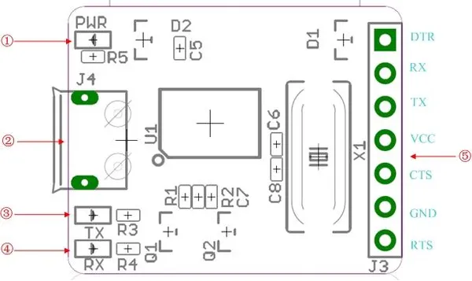

# USB To Uart 5V

**Seeed Studio** · Source collection

Revision: Unverified source identity  
Coverage: Source collection; review pending

[Browse all manufacturers](../../../../BROWSE.md) · [Desktop app](https://github.com/valleytechsolutions/black-wire-desktop)

## Interfaces

**source reference** · Unreviewed source · JPG

[Open original reference](../../../../library/media/6665e4d934fa648db791eeb52a3b720ffa912f9f60789be0546e2fd8228f2324.jpg)

**Credit and rights:** Source rights not yet established. Source/manufacturer: Seeed Studio.

[Source 1](https://files.seeedstudio.com/wiki/USB_To_Uart_5V/img/USB_To_Uart_5v_interface.jpg) · [Source 2](https://wiki.seeedstudio.com/USB_To_Uart_5V/)

Original source index: Interfaces. This file is searchable but has not been promoted to a reviewed physical board pinout.

SHA-256: `6665e4d934fa648db791eeb52a3b720ffa912f9f60789be0546e2fd8228f2324`

Pin assignments have not been independently electrically verified. Check board revision before wiring.
