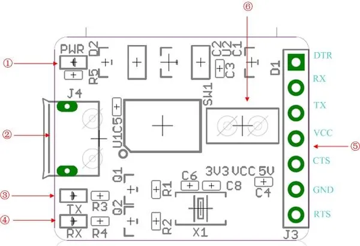

# USB To Uart 5V-3V3

**Seeed Studio** · Source collection

Revision: Unverified source identity  
Coverage: Source collection; review pending

[Browse all manufacturers](../../../../BROWSE.md) · [Desktop app](https://github.com/valleytechsolutions/black-wire-desktop)

## Interfaces

**source reference** · Unreviewed source · JPG

[Open original reference](../../../../library/media/39f08987bdd14f8ec58f1f20a883dec12f8fe3837ff780bc123f794359a907c8.jpg)

**Credit and rights:** Source rights not yet established. Source/manufacturer: Seeed Studio.

[Source 1](https://files.seeedstudio.com/wiki/USB_To_Uart_5V_3V3/img/USB_To_Uart_5V_3V3.jpg) · [Source 2](https://wiki.seeedstudio.com/USB_To_Uart_5V_3V3/)

Original source index: Interfaces. This file is searchable but has not been promoted to a reviewed physical board pinout.

SHA-256: `39f08987bdd14f8ec58f1f20a883dec12f8fe3837ff780bc123f794359a907c8`

Pin assignments have not been independently electrically verified. Check board revision before wiring.
