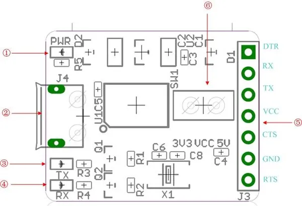

# USB To Uart 5V-3V3

**Seeed Studio** · Source collection

Revision: Unverified source identity

Coverage: Source collection; review pending

[Browse all manufacturers](../../../../BROWSE.md) · [Devices & IoT](../../../../DEVICES.md) · [Open in the browser guide](https://valleytech-black-wire-guide.pages.dev/?board=source-board-06371a7dd03c1eeea5)

## Datasheets and original documentation

Board datasheet: **not yet recorded**. Visual reference: **available**.

[Manufacturer source (recorded link)](https://wiki.seeedstudio.com/USB_To_Uart_5V_3V3/)

A chip datasheet, schematic and board datasheet have different scopes. Match the exact hardware revision.

[Documentation coverage and remaining gaps](../../../../DOCUMENTATION.md)

## Interfaces

**source reference** · Unreviewed source · JPG

[Open original reference](../../../../library/media/39f08987bdd14f8ec58f1f20a883dec12f8fe3837ff780bc123f794359a907c8.jpg)

**Credit and rights:** Source rights not yet established. Source/manufacturer: Seeed Studio.

[Source 1](https://files.seeedstudio.com/wiki/USB_To_Uart_5V_3V3/img/USB_To_Uart_5V_3V3.jpg) · [Source 2](https://wiki.seeedstudio.com/USB_To_Uart_5V_3V3/)

Original source index: Interfaces. This file is searchable but has not been promoted to a reviewed physical board pinout.

Image revision: Not identified

SHA-256: `39f08987bdd14f8ec58f1f20a883dec12f8fe3837ff780bc123f794359a907c8`

Pin assignments have not been independently electrically verified. Check board revision before wiring.
