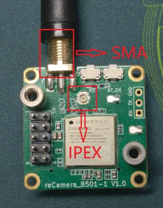
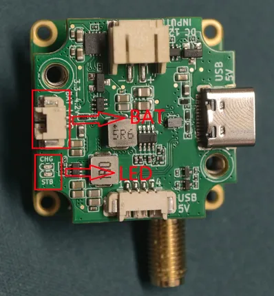
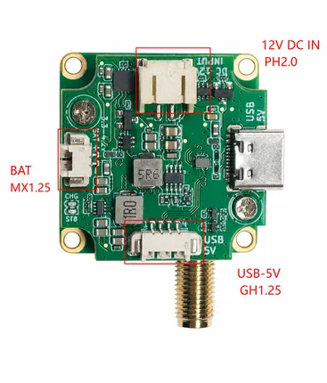

# Wi-Fi HaLow Module for reCamera

**Seeed Studio** · Source collection

Revision: Unverified source identity  
Coverage: Source collection; review pending

[Browse all manufacturers](../../../../BROWSE.md) · [Desktop app](https://github.com/valleytechsolutions/black-wire-desktop)

## Hardware Overview (Antenna Connectors)

**source reference** · Unreviewed source · JPG

[Open original reference](../../../../library/media/722919d5eefc800d5e391dab249614745a8d5f5c2571147edbc19654ee4dfcce.jpg)

**Credit and rights:** Source rights not yet established. Source/manufacturer: Seeed Studio.

[Source 1](https://files.seeedstudio.com/wiki/reCamera/reCamera_Wifi_Halow/wifi_halow_antenna.jpg) · [Source 2](https://wiki.seeedstudio.com/wifi_halow_getting_started/)

Original source index: Hardware Overview (Antenna Connectors). This file is searchable but has not been promoted to a reviewed physical board pinout.

SHA-256: `722919d5eefc800d5e391dab249614745a8d5f5c2571147edbc19654ee4dfcce`

## Hardware Overview (Battery & LEDs)

**source reference** · Unreviewed source · JPG

[Open original reference](../../../../library/media/85e32261d30d7c3ec6ee80d7247184695da2dc463936bcf66a7d31e41f3530d5.jpg)

**Credit and rights:** Source rights not yet established. Source/manufacturer: Seeed Studio.

[Source 1](https://files.seeedstudio.com/wiki/reCamera/reCamera_Wifi_Halow/wifi_halow_BAT.jpg) · [Source 2](https://wiki.seeedstudio.com/wifi_halow_getting_started/)

Original source index: Hardware Overview (Battery & LEDs). This file is searchable but has not been promoted to a reviewed physical board pinout.

SHA-256: `85e32261d30d7c3ec6ee80d7247184695da2dc463936bcf66a7d31e41f3530d5`

## Interfaces

**source reference** · Unreviewed source · PNG

[Open original reference](../../../../library/media/0d0746304d48dc33a0dd2bdb1116df6e43c6ff58c8a0ec5dc7eab714feea7858.png)

**Credit and rights:** Source rights not yet established. Source/manufacturer: Seeed Studio.

[Source 1](https://files.seeedstudio.com/wiki/reCamera/reCamera_Wifi_Halow/getting_start/wifi_halow_line.png) · [Source 2](https://wiki.seeedstudio.com/wifi_halow_getting_started/)

Original source index: Interfaces. This file is searchable but has not been promoted to a reviewed physical board pinout.

SHA-256: `0d0746304d48dc33a0dd2bdb1116df6e43c6ff58c8a0ec5dc7eab714feea7858`

Pin assignments have not been independently electrically verified. Check board revision before wiring.
