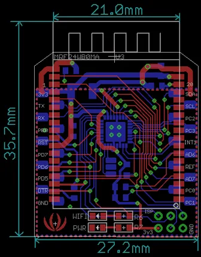
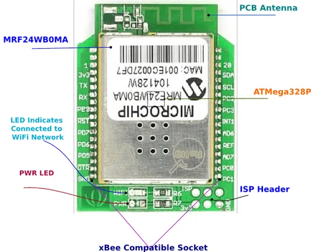

# Wifi Bee

**Seeed Studio** · Source collection

Revision: Unverified source identity

Coverage: Source collection; review pending

[Browse all manufacturers](../../../../BROWSE.md) · [Devices & IoT](../../../../DEVICES.md) · [Open in the browser guide](https://valleytech-black-wire-guide.pages.dev/?board=source-board-162d81500e3c01ba14)

## Datasheets and original documentation

Board datasheet: **not yet recorded**. Visual reference: **available**.

[Manufacturer source (recorded link)](https://wiki.seeedstudio.com/Wifi_Bee/)

A chip datasheet, schematic and board datasheet have different scopes. Match the exact hardware revision.

[Documentation coverage and remaining gaps](../../../../DOCUMENTATION.md)

## Dimensions

**source reference** · Unreviewed source · PNG

[Open original reference](../../../../library/media/69ee6584baf9511e6464d9a0336591e59ff2691f710eddc34e5e6e5c325569ce.png)

**Credit and rights:** Source rights not yet established. Source/manufacturer: Seeed Studio.

[Source 1](https://files.seeedstudio.com/wiki/Wifi_Bee/img/Wifi_Bee_v0.91b_pcb.png) · [Source 2](https://wiki.seeedstudio.com/Wifi_Bee/)

Original source index: Dimensions. This file is searchable but has not been promoted to a reviewed physical board pinout.

Image revision: Not identified

SHA-256: `69ee6584baf9511e6464d9a0336591e59ff2691f710eddc34e5e6e5c325569ce`

## Hardware Overview

**source reference** · Unreviewed source · PNG

[Open original reference](../../../../library/media/29d247585000b926ed1f023d33d6761a33bc08b05cf7cea6a1147b0282bec5ca.png)

**Credit and rights:** Source rights not yet established. Source/manufacturer: Seeed Studio.

[Source 1](https://files.seeedstudio.com/wiki/Wifi_Bee/img/Seeedstudio_WifiBee_Parts.png) · [Source 2](https://wiki.seeedstudio.com/Wifi_Bee/)

Original source index: Hardware Overview. This file is searchable but has not been promoted to a reviewed physical board pinout.

Image revision: Not identified

SHA-256: `29d247585000b926ed1f023d33d6761a33bc08b05cf7cea6a1147b0282bec5ca`

Pin assignments have not been independently electrically verified. Check board revision before wiring.
