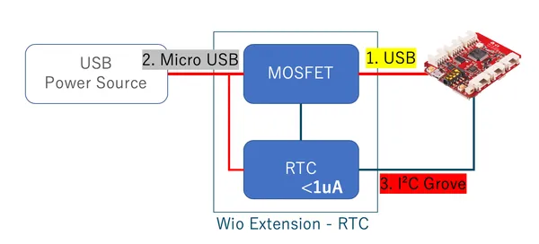
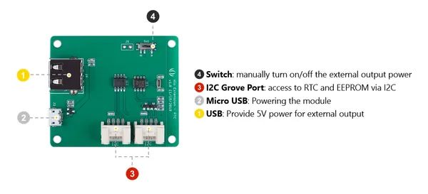

# Wio Extension RTC

**Seeed Studio** · Source collection

Revision: Unverified source identity  
Coverage: Source collection; review pending

[Browse all manufacturers](../../../../BROWSE.md) · [Desktop app](https://github.com/valleytechsolutions/black-wire-desktop)

## Block Diagram

**source reference** · Unreviewed source · PNG

[Open original reference](../../../../library/media/43c626cafed58fd35e6d73ec8771b06c81951b2313dfdb0336b6a305cbb75bee.png)

**Credit and rights:** Source rights not yet established. Source/manufacturer: Seeed Studio.

[Source 1](https://files.seeedstudio.com/wiki/Wio_Extension-RTC/img/rtc_diagram.png) · [Source 2](https://wiki.seeedstudio.com/Wio-Extension-RTC/)

Original source index: Block Diagram. This file is searchable but has not been promoted to a reviewed physical board pinout.

SHA-256: `43c626cafed58fd35e6d73ec8771b06c81951b2313dfdb0336b6a305cbb75bee`

## Hardware Overview

**source reference** · Unreviewed source · JPG

[Open original reference](../../../../library/media/8e8ad3d4b90b0e51b3be65262b7df57fea62b3e750ff2b74fb237dbe1dbd7e46.jpg)

**Credit and rights:** Source rights not yet established. Source/manufacturer: Seeed Studio.

[Source 1](https://files.seeedstudio.com/wiki/Wio_Extension-RTC/img/pinout.jpg) · [Source 2](https://wiki.seeedstudio.com/Wio-Extension-RTC/)

Original source index: Hardware Overview. This file is searchable but has not been promoted to a reviewed physical board pinout.

SHA-256: `8e8ad3d4b90b0e51b3be65262b7df57fea62b3e750ff2b74fb237dbe1dbd7e46`

Pin assignments have not been independently electrically verified. Check board revision before wiring.
